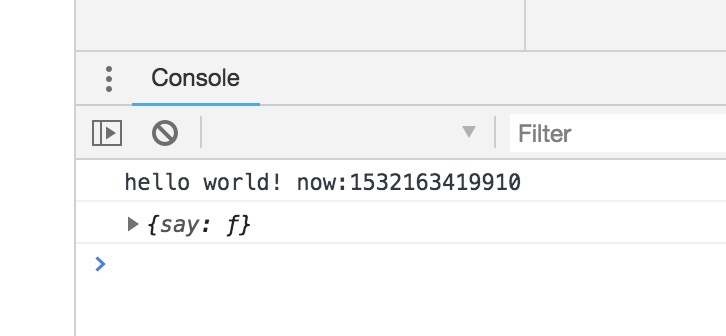

# module

javascript 模块化基本有两种方案：

+ CommonJS
+ ES Module


此部分内容需要对node,和npm具有一定的了解


## CommonJS

该片文章内容[出处](https://www.cnblogs.com/littlebirdlbw/p/5670633.html)

### 介绍

JS没有系统模块，标准库又少，缺乏包管理工具，为了能让JS能有JAVA，PHP，C#的具备大型应用的开发能力。CommonJS规范就诞生了。

在CommonJs规范中：

+ 一个文件就是一个模块，都有单独的作用域。普通的定义方式的变量，函数，对象都属于该模块

+  node实现了commonjs规范，其提供的对象如下：

  + `__dirname` 代表当前**模块文件**所在文件夹的位置

  + `__filename` 代表当前**模块文件**所在的文件的的位置

  + `require` (同步)模块加载功能，引入一个模块或者js文件

  + `exports`,`module.exports`模块导出对象，当需要导出的对象则输出到`exports`对象中

    > E.g.
    >
    > ```javascript
    > module.exports = {
    >     //...
    > } 
    > //或者
    > exports.xxx = ...;
    > exports[xxx] = ...;
    > 
    > //注意：下面这个写法是无效的
    > exports = {
    >     ....
    > };
    > /*
    > 由于node设定 exports = module.exports，因此exports 引用的是module.exports 的地址，所以直接exports = {}的赋值操作就是覆盖了module.exports的引用地址，所以exports={}会失效。
    > */
    > ```


### 案例

创建`demo-module`模块文件夹，并使用Npm初始化

```shell
$mkdir demo-module
$cd demo-module
$npm init -y
```

安装`lodash`模块，关于[[lodash](https://www.lodashjs.com/)]

```shell
$npm install lodash
```

文件结构：

```diff
  .
  ├── node_modules
  │   └── ...
  ├── package-lock.json
  ├── package.json
  └── src
+     ├── hello.js
+     └── main.js
```

**./package.json**

```diff
  {
    "name": "demo-module",
    "version": "1.0.0",
    "description": "",
+   "main": "./src/main.js",
-   "main": "index.js",
    "scripts": {
      "test": "echo \"Error: no test specified\" && exit 1"
    },
    "keywords": [],
    "author": "",
    "license": "ISC",
    "dependencies": {
      "lodash": "^4.17.10"
    }
  }
```

**./src/hello.js**

```javascript
//引入lodash对象
const _ = require('lodash');

let hello = {
	say: function () {
		console.log('hello world! now:'+_.now());
	}
};

//导出hello对象
module.exports = hello;
```

**./src/main.js**

```javascript
//引入hello文件(一个文件也可是一个模块)
const hello = require('./hello');

hello.say();
//查看hello对象
console.info(hello);
```

测试运行：

```shell
#使用——inspect-brk 指令让chrome的开发者工具来调试
$node --inspect-brk ./src/main.js
```




正常运行，说明`require`,` exports`等关键字执行结果正常。


## ES6 module

> 文章内容部分[出处](https://www.cnblogs.com/libin-1/p/7127481.html)

ES6 也出了一套module方案，使用`import` 和`export`

### 介绍

+ **`export`**

  **export**有两种模块导出方式：**命名式导出** 和 **默认导出**。命名式导出可以多个，而默认导出 则每个模块只有一个。

  + `export {name} or export { v1 as name }`
  + `export default ...`

  ```javascript
  export { name1, name2, …, nameN };
  export { variable1 as name1, variable2 as name2, …, nameN };
  export let name1, name2, …, nameN; // also var
  export let name1 = …, name2 = …, …, nameN; // also var, const
   
  export default expression;
  export default function (…) { … } // also class, function*
  export default function name1(…) { … } // also class, function*
  export { name1 as default, … };
   
  export * from …;
  export { name1, name2, …, nameN } from …;
  export { import1 as name1, import2 as name2, …, nameN } from …;
  ```

+ **`import`**

  **import**和**export**导出对应，默认 import 就是导入default

  ```javascript
  import defaultMember from "module-name";
  import * as name from "module-name";
  import { member } from "module-name";
  import { member as alias } from "module-name";
  import { member1 , member2 } from "module-name";
  import { member1 , member2 as alias2 , [...] } from "module-name";
  import defaultMember, { member [ , [...] ] } from "module-name";
  import defaultMember, * as name from "module-name";
  import "module-name";
  ```

  

### 案例

> 由于node暂时还为支持`ES6 module`，则使用`babel`工具进行编译转码成`commonjs`语法
>
> 接上面的`commonjs`的案例的内容。

安装和配置 `babel`

```shell
#全局安装babel的cli工具
$npm install -g babel-cli

#安装babel编规则插件
$npm install --save-dev babel-preset-env
```

新建`.babelrc`文件

```diff
  .
  ├── node_modules
  │   └── ...
  ├── package-lock.json
  ├── package.json
+ ├── .babel.rc
  └── src
      ├── hello.js
      └── main.js
```

**./.babelrc**

```json
{
	"presets":["env"]
}
```

**./src/hello.js**

```diff
  //引入lodash对象
- const _ = require('lodash');
+ import _ from 'lodash';
  
  let hello = {
  	say: function () {
  		console.log('hello world! now:'+_.now());
  	}
  };
  
  //导出hello对象
- module.exports = hello;
+ export default hello;

```

**./src/main.js**

```diff
  //引入hello文件(一个文件也可是一个模块)
- const hello = require('./hello');
+ import hello from './hello';
  
  hello.say();
  console.info(hello);
```

最后执行`babel-node`指令来运行

```shell
$babel-node ./src/main.js
#下面是运行结果
hello world! now:1532334021145
{ say: [Function: say] }
```

> 实际上babel只是将es module语法转换为commonjs 语法。执行还是得用Node，单纯`babel`只是编译,`babel-node`指令才是编译后执行
>
> E.g.
>
> ```shell
> $babel ./src/main.js
> #下面是运行结果
> 'use strict';
> 
> var _hello = require('./hello');
> 
> var _hello2 = _interopRequireDefault(_hello);
> 
> function _interopRequireDefault(obj) { return obj && obj.__esModule ? obj : { default: obj }; }
> 
> _hello2.default.say();
> console.info(_hello2.default);
> 
> ```


## 总结

+ Commonjs 比 ES6 module 比较容易清楚，export是什么 require的到的就是什么，对象里面清清楚楚
+ Commonjs 是同步加载的，也就是执行到require语句才会同步加载模块，而且引入的是js是对象，受到原来模块的修改影响
+ ES6 module 的import只能写在最顶端，在执行代码之前就导入完毕了，不受到原来模块内部修改的影响
+ 暂时Node上不支持ES6 module的写法，目前只能通过`babel`来预先编译成`commonjs`的写法
+ ES6 module 的export 拥有默认导出的写法

