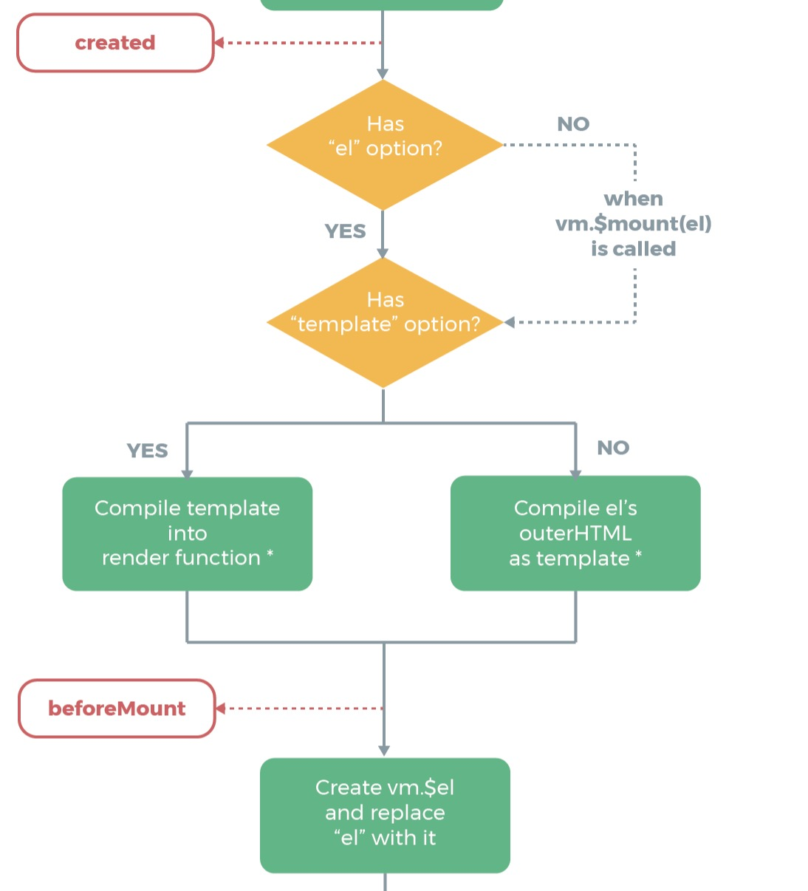

# vue的组件化

[vue官文](https://cn.vuejs.org/v2/guide/)

一般VUE的知识点因为已经有很棒的官文（中文）了，所以不写了。这里主要是写关于vue高阶应用：模块组件化的使用。

阅读此文章需要有对[npm](../npm),[webpack](../webpack),[module](../javascript/module.md)一定的认识。

首先，我们先了解.vue文件。官网中已经有对.vue文件的解释了。

主要有3个部分组成

+ template
+ script
+ style

分别是html,js,css内容

实质上.vue内容就是vue包含了css的组件化内容

具体详细内容请查阅官方文档-->[单文件组件](https://cn.vuejs.org/v2/guide/single-file-components.html)


# hello world

这是一个hello world案例来认识了解.vue文件使用

**准备工作**

+ 准备工作空间

  ```shell
  $mkdir hello-vue
  $cd hello-vue
  #快速初始化npm项目
  $npm init -y
  #安装webpack
  $npm install --save-dev webpack
  #安装vue所需模块
  $npm install --save-dev vue-template-compiler vue vue-loader vue-style-loader css-loader
  ```

  所需的依赖列

  ```json
  {
    "devDependencies": {
      "vue": "^2.5.16",
      "vue-loader": "^15.2.4",
      "vue-style-loader": "^4.1.0",
      "vue-template-compiler": "^2.5.16",
      "webpack": "^4.16.0"
    }
  }
  ```

+ 新增/修改文件

  ```diff
    .
  + ├── dist
  + │   └── index.html
    ├── node_modules
    │   └── ...
    ├── package-lock.json
    ├── package.json
  + ├── src
  + │   ├── main.js
  + │   └── scripts
  + │       └── hello.vue
  + └── webpack.config.js
  ```

  **./package.json**

  > 将项目改为私有项目防止手误发布，并去除main，该项目为webpack项目非node可执行项目
  >
  > 新增`webpack`打包指令，`webpack.config.js`

  ```diff
    {
      "name": "hello-vue",
      "version": "1.0.0",
      "description": "",
  +   "private": true,
  -   "main": "index.js",
      "scripts": {
  +     "build": "webpack --config webpack.config.js",
        "test": "echo \"Error: no test specified\" && exit 1"
      },
      "keywords": [],
      "author": "",
      "license": "ISC",
      "devDependencies": {
        "vue": "^2.5.16",
        "vue-loader": "^15.2.4",
        "vue-style-loader": "^4.1.0",
        "vue-template-compiler": "^2.5.16",
        "webpack": "^4.16.0"
      }
    }
  
  ```

  **./webpack.config.js**

  > 为webpack配置文件

  ```javascript
  module.exports = {
      devtool: 'source-map',
      entry: './src/main.js',
      output: {
          path: __dirname + '/dist',
          //编译打包输出的文件名
          filename: "vue.bundle.js"
      },
      module: {
          rules: [
              //vue 文件使用vue-loader
              { test: /\.vue$/ , use: ['vue-loader']}
          ]
      }
  };
  ```

  **./src/scripts/hello.vue**

  > 简单的Hello world渲染

  ```vue
  <template>
      <p>{{ greeting }} world!</p>
  </template>
  <script type="text/javascript">
      export default {
          data() {
              return {
                  greeting: 'hello'
              }
          }
      }
  </script>
  <style scoped>
      p{
          font-size: 28px;
          color: #eee;
          background: black;
      }
  </style>
  ```

  **./src/main.js**

  > 简单渲染一个id 为hello范围内的vue组件

  ```javascript
  import Vue from 'vue';
  import hello from './scripts/hello.vue';
  
  new Vue({
      el: '#hello',
      render: h => h(hello)
  });
  ```

  **./dist/index.html**

  > 用于展示效果的测试页面

  ```html
  <!DOCTYPE html>
  <html>
      <head>
          <title>hello vue!</title>
      </head>
      <body>
          <div id="hello"></div>
      </body>
      <script type="text/javascript" src="vue.bundle.js"></script>
  </html>
  ```


**然后打包测试**

```shell
IDE_Workspace/WebStorm/hello-vue                                                                     
▶ npm run build
#下面是运行结果

> hello-vue@1.0.0 build /Users/.../Documents/IDE_Workspace/WebStorm/hello-vue
> webpack --config webpack.config.js

One CLI for webpack must be installed. These are recommended choices, delivered as separate packages:
 - webpack-cli (https://github.com/webpack/webpack-cli)
   The original webpack full-featured CLI.
 - webpack-command (https://github.com/webpack-contrib/webpack-command)
   A lightweight, opinionated webpack CLI.
We will use "npm" to install the CLI via "npm install -D".
Which one do you like to install (webpack-cli/webpack-command):
#此处提示需要安装webpack-cli或者webpack-command组件
webpack-cli
Installing 'webpack-cli' (running 'npm install -D webpack-cli')...
#这里报警提示需要css-loader前置
npm WARN vue-loader@15.2.4 requires a peer of css-loader@* but none is installed. You must install peer dependencies yourself.

+ webpack-cli@3.0.8
added 69 packages from 34 contributors and audited 3597 packages in 10.36s
found 0 vulnerabilities

#webpack-cli安装完毕开始打包
Hash: c1226a0af443e990023b
Version: webpack 4.16.0
Time: 2743ms
Built at: 07/17/2018 3:08:09 AM
 2 assets
[0] (webpack)/buildin/global.js 489 bytes {0} [built]
[1] ./src/scripts/hello.vue?vue&type=template&id=70153082&scoped=true 165 bytes {0} [built] [failed] [1 error]
[3] ./src/main.js + 3 modules 4.03 KiB {0} [built] [1 error]
    | ./src/main.js 104 bytes [built]
    | ./src/scripts/hello.vue 1.18 KiB [built] [1 error]
    | ./src/scripts/hello.vue?vue&type=script&lang=js 105 bytes [built]
    |     + 1 hidden module
[4] ./src/scripts/hello.vue?vue&type=style&index=0&id=70153082&scoped=true&lang=css 184 bytes {0} [built] [failed] [1 error]
    + 4 hidden modules

WARNING in configuration
The 'mode' option has not been set, webpack will fallback to 'production' for this value. Set 'mode' option to 'development' or 'production' to enable defaults for each environment.
You can also set it to 'none' to disable any default behavior. Learn more: https://webpack.js.org/concepts/mode/

#hello.vue有一处错误
ERROR in ./src/scripts/hello.vue
Module Error (from ./node_modules/vue-loader/lib/index.js):
vue-loader was used without the corresponding plugin. Make sure to include VueLoaderPlugin in your webpack config.
 @ ./src/main.js 2:0-40 5:19-24

#解析vue中的style错误
ERROR in ./src/scripts/hello.vue?vue&type=style&index=0&id=70153082&scoped=true&lang=css 14:1
Module parse failed: Unexpected token (14:1)
You may need an appropriate loader to handle this file type.
| 
| 
> p{
|     font-size: 28px;
|     color: #eee;
 @ ./src/scripts/hello.vue 4:0-88
 @ ./src/main.js

#此错误看上去应该是和上面没有配置VueLoaderPlugin导致的
ERROR in ./src/scripts/hello.vue?vue&type=template&id=70153082&scoped=true 2:0
Module parse failed: Unexpected token (2:0)
You may need an appropriate loader to handle this file type.
| 
> <p>{{ greeting }} world!</p>
| 
 @ ./src/scripts/hello.vue 1:0-95 11:2-8 12:2-17
 @ ./src/main.js
npm ERR! code ELIFECYCLE
npm ERR! errno 2
npm ERR! hello-vue@1.0.0 build: `webpack --config webpack.config.js`
npm ERR! Exit status 2
npm ERR! 
npm ERR! Failed at the hello-vue@1.0.0 build script.
npm ERR! This is probably not a problem with npm. There is likely additional logging output above.

npm ERR! A complete log of this run can be found in:
npm ERR!     /Users/..../.npm/_logs/2018-07-16T19_08_09_173Z-debug.log

```

综上述运行结果，得出以下问题：

+ `vue-loader` 需要`css-loader` 为前缀

  > ```shell
  > npm WARN vue-loader@15.2.4 requires a peer of css-loader@* but none is installed. You must install peer dependencies yourself.
  > ```

+ 解析`.vue`文件出错，`webpack`的配置中需要`VueLoaderPlugin`插件

  > ```shell
  > ERROR in ./src/scripts/hello.vue
  > Module Error (from ./node_modules/vue-loader/lib/index.js):
  > vue-loader was used without the corresponding plugin. Make sure to include VueLoaderPlugin in your webpack config.
  > ```

  这个问题我在[vue-loader](https://vue-loader.vuejs.org/migrating.html#migrating-from-v14)的说明上查到:

  > `vue-loader`从v15版本开始需要配置`VueLoaderPlugin`插件，具体配置方式如下：
  >
  > ```javascript
  > // webpack.config.js
  > const VueLoaderPlugin = require('vue-loader/lib/plugin')
  > 
  > module.exports = {
  >   // ...
  >   plugins: [
  >     new VueLoaderPlugin()
  >   ]
  > }
  > ```

+ 解析`.vue`中的`<style></style>`中的`css`内容错误

  > ```shell
  > ERROR in ./src/scripts/hello.vue?vue&type=style&index=0&id=70153082&scoped=true&lang=css 14:1
  > Module parse failed: Unexpected token (14:1)
  > You may need an appropriate loader to handle this file type.
  > | 
  > | 
  > > p{
  > |     font-size: 28px;
  > |     color: #eee;
  >  @ ./src/scripts/hello.vue 4:0-88
  >  @ ./src/main.js
  > 
  > 
  > ```

  这个问题在[vue-loader的说明](https://vue-loader.vuejs.org/#what-is-vue-loader)上看到：

  > Treat static assets referenced in `<style>` and `<template>` as module dependencies and handle them with webpack loaders;

  意思是vue-loader处理`<style>`和 `<template>`标签会当做静态资源交给`webpack`处理，即`<template>`会转为`.html`文件处理，`<style>`内容会转为`.css`文件处理

知道问题所在了，接下来就好解决了

+ 安装`css-loader`解决`vue-loader`的前置依赖问题

  ```shell
  $npm install --save-dev css-loader
  ```

+ `webpack.config.js`增加`VueLoaderPlugin`

  **./webpack.config.js**

  ```diff
  + const VueLoaderPlugin = require('vue-loader/lib/plugin');
    
    module.exports = {
        devtool: 'source-map',
        entry: './src/main.js',
        output: {
            path: __dirname + '/dist',
            filename: "vue.bundle.js"
        },
        module: {
            rules: [
                { test: /\.vue$/ , use: ['vue-loader']}
            ]
        },
  +     plugins: [
  +         new VueLoaderPlugin()
  +     ]
    };
  ```

+ 安装css加载器所需依赖

  ```shell
  $npm install --save-dev style-loader
  ```

  > `css-loader`在处理`vue-loader`依赖的时候安装了

  **./webpack.config.js**

  增加css加载规则

  ```diff
    const VueLoaderPlugin = require('vue-loader/lib/plugin');
    
    module.exports = {
        devtool: 'source-map',
        entry: './src/main.js',
        output: {
            path: __dirname + '/dist',
            filename: "vue.bundle.js"
        },
        module: {
            rules: [
                { test: /\.vue$/ , use: ['vue-loader']},
  +             { test: /\.css$/ , use: ['style-loader','css-loader']}
            ]
        },
        plugins: [
            new VueLoaderPlugin()
        ]
    };
  ```

  > **注：style-loader 和 css-loader 顺序必须style-loader在前**

接下来再次打包测试：

```shell
IDE_Workspace/WebStorm/hello-vue
▶  npm run build

> hello-vue@1.0.0 build /Users/.../Documents/IDE_Workspace/WebStorm/hello-vue
> webpack --config webpack.config.js

Hash: 430ee451d0e6e2c9c156
Version: webpack 4.16.0
Time: 2479ms
Built at: 07/17/2018 3:49:23 AM
            Asset      Size  Chunks             Chunk Names
    vue.bundle.js  72.2 KiB       0  [emitted]  main
vue.bundle.js.map   371 KiB       0  [emitted]  main
[0] ./node_modules/style-loader!./node_modules/css-loader!./node_modules/vue-loader/lib/loaders/stylePostLoader.js!./node_modules/vue-loader/lib??vue-loader-options!./src/scripts/hello.vue?vue&type=style&index=0&id=70153082&scoped=true&lang=css 1.59 KiB {0} [built]
[1] (webpack)/buildin/global.js 489 bytes {0} [built]
[3] ./src/main.js + 6 modules 4.75 KiB {0} [built]
    | ./src/main.js 122 bytes [built]
    | ./src/scripts/hello.vue 1.18 KiB [built]
    | ./src/scripts/hello.vue?vue&type=template&id=70153082&scoped=true 214 bytes [built]
    | ./src/scripts/hello.vue?vue&type=script&lang=js 256 bytes [built]
    | ./node_modules/vue-loader/lib/loaders/templateLoader.js??vue-loader-options!./node_modules/vue-loader/lib??vue-loader-options!./src/scripts/hello.vue?vue&type=template&id=70153082&scoped=true 254 bytes [built]
    | ./node_modules/vue-loader/lib??vue-loader-options!./src/scripts/hello.vue?vue&type=script&lang=js 105 bytes [built]
    |     + 1 hidden module
[7] ./node_modules/css-loader!./node_modules/vue-loader/lib/loaders/stylePostLoader.js!./node_modules/vue-loader/lib??vue-loader-options!./src/scripts/hello.vue?vue&type=style&index=0&id=70153082&scoped=true&lang=css 252 bytes {0} [built]
[8] ./src/scripts/hello.vue?vue&type=style&index=0&id=70153082&scoped=true&lang=css 602 bytes {0} [built]
    + 7 hidden modules

WARNING in configuration
The 'mode' option has not been set, webpack will fallback to 'production' for this value. Set 'mode' option to 'development' or 'production' to enable defaults for each environment.
You can also set it to 'none' to disable any default behavior. Learn more: https://webpack.js.org/concepts/mode/

```

可以看到打包成功。生成`vue.bundle.js`文件

```diff
  .
  ├── dist
+ │   ├── vue.bundle.js
  │   └── index.html
  ├── node_modules
  │   └── ...
  ├── package-lock.json
  ├── package.json
  ├── src
  │   ├── main.js
  │   └── scripts
  │       └── hello.vue
  └── webpack.config.js
```

打开`./dist/index.html`看看效果：


如图vue渲染成功！

但是，却并没有`vue`开发者模块并没有被启用。

`vue`的`chrome`插件的说明如图:


> 意思是已经检测到该页面使用了`vue`，但是模式可能因为启用了**生产模式**或者被**作者禁用**导致开发者模式的`vue`工具失效。

意思很明白了，我们在webpack打包的时候，没有设定`mode`。

解决：在webpack.config.js中配置mode

**./webpack.config.js**

```diff
  const VueLoaderPlugin = require('vue-loader/lib/plugin');
  
  module.exports = {
+     mode: 'development',
      devtool: 'source-map',
      entry: './src/main.js',
      output: {
          path: __dirname + '/dist',
          filename: "vue.bundle.js"
      },
      module: {
          rules: [
              { test: /\.vue$/ , use: ['vue-loader']},
              { test: /\.css$/ , use: ['style-loader','css-loader']}
          ]
      },
      plugins: [
          new VueLoaderPlugin()
      ]
  };
```

再次打包

```shell
IDE_Workspace/WebStorm/hello-vue                                                                    
$npm run build

> hello-vue@1.0.0 build /Users/.../Documents/IDE_Workspace/WebStorm/hello-vue
> webpack --config webpack.config.js

Hash: 84e2606c778c41d50acb
Version: webpack 4.16.0
Time: 1112ms
Built at: 07/17/2018 9:43:23 PM
            Asset     Size  Chunks             Chunk Names
    vue.bundle.js  258 KiB    main  [emitted]  main
vue.bundle.js.map  304 KiB    main  [emitted]  main
[./node_modules/css-loader/index.js!./node_modules/vue-loader/lib/loaders/stylePostLoader.js!./node_modules/vue-loader/lib/index.js?!./src/scripts/hello.vue?vue&type=style&index=0&id=70153082&scoped=true&lang=css] ./node_modules/css-loader!./node_modules/vue-loader/lib/loaders/stylePostLoader.js!./node_modules/vue-loader/lib??vue-loader-options!./src/scripts/hello.vue?vue&type=style&index=0&id=70153082&scoped=true&lang=css 252 bytes {main} [built]
[./node_modules/style-loader/index.js!./node_modules/css-loader/index.js!./node_modules/vue-loader/lib/loaders/stylePostLoader.js!./node_modules/vue-loader/lib/index.js?!./src/scripts/hello.vue?vue&type=style&index=0&id=70153082&scoped=true&lang=css] ./node_modules/style-loader!./node_modules/css-loader!./node_modules/vue-loader/lib/loaders/stylePostLoader.js!./node_modules/vue-loader/lib??vue-loader-options!./src/scripts/hello.vue?vue&type=style&index=0&id=70153082&scoped=true&lang=css 1.59 KiB {main} [built]
[./node_modules/vue-loader/lib/index.js?!./src/scripts/hello.vue?vue&type=script&lang=js] ./node_modules/vue-loader/lib??vue-loader-options!./src/scripts/hello.vue?vue&type=script&lang=js 105 bytes {main} [built]
[./node_modules/vue-loader/lib/loaders/templateLoader.js?!./node_modules/vue-loader/lib/index.js?!./src/scripts/hello.vue?vue&type=template&id=70153082&scoped=true] ./node_modules/vue-loader/lib/loaders/templateLoader.js??vue-loader-options!./node_modules/vue-loader/lib??vue-loader-options!./src/scripts/hello.vue?vue&type=template&id=70153082&scoped=true 254 bytes {main} [built]
[./node_modules/webpack/buildin/global.js] (webpack)/buildin/global.js 489 bytes {main} [built]
[./src/main.js] 122 bytes {main} [built]
[./src/scripts/hello.vue] 1.18 KiB {main} [built]
[./src/scripts/hello.vue?vue&type=script&lang=js] 256 bytes {main} [built]
[./src/scripts/hello.vue?vue&type=style&index=0&id=70153082&scoped=true&lang=css] 602 bytes {main} [built]
[./src/scripts/hello.vue?vue&type=template&id=70153082&scoped=true] 214 bytes {main} [built]
    + 8 hidden modules
```

可以看到之前的`WARNING`警告也消失了。

打开`./dist/index.html`并调出开发者模式工具


可以看到`vue`的开发者模式工具也能正常查看使用了

> 关于`webpack`的`mode`选项配置，更多选择与说明查看[官网](https://webpack.js.org/concepts/mode/)


#关于vue的构建

现在修改`main.js`，`index.html`的内容

**./src/main.js**

> 新增关于在浏览器环境下经常用到的渲染方式

```diff
  import Vue from 'vue';
  import hello from './scripts/hello.vue';
  
  new Vue({
      el: '#hello',
      render: h => h(hello)
  });
  
+ Vue.component("test",{
+     template: '<span> test - span </span>'
+ });
+ new Vue({
+     el: '#test',
+     components: {
+         "hello": hello
+     },
+     data: {
+         message : 'from test - message : hello vue! hello world!'
+     }
+ });
```

**./dist/index.html**

```diff
  <!DOCTYPE html>
  <html>
      <head>
          <title>hello vue!</title>
      </head>
      <body>
          <div id="hello" ></div>
+         <div id="test">
+             {{ message }}
+             <hello></hello>
+             <test></test>
+         </div>
      </body>
      <script type="text/javascript" src="vue.bundle.js"></script>
  </html>
```

执行`npm run build` 查看测试


提示错误：`[Vue warn]: You are using the runtime-only build of Vue where the template compiler is not available. Either pre-compile the templates into render functions, or use the compiler-included build.`

发现正常情况下在浏览器中`<script ...>`使用的语句居然渲染失效了。

这个问题就要从vue的构建模式来说明了

在[官网](https://cn.vuejs.org/v2/guide/installation.html)就有关于这部分问题的内容：

---

> 以下内容为节选：
>
> ## 对不同构建版本的解释
>
> 在 [NPM 包的 `dist/` 目录](https://cdn.jsdelivr.net/npm/vue/dist/)你将会找到很多不同的 Vue.js 构建版本。这里列出了它们之间的差别：
>
> 下面的内容关于vue的构建理解和问题。
>
> |                               | UMD                | CommonJS              | ES Module          |
> | ----------------------------- | ------------------ | --------------------- | ------------------ |
> | **完整版**                    | vue.js             | vue.common.js         | vue.esm.js         |
> | **只包含运行时版**            | vue.runtime.js     | vue.runtime.common.js | vue.runtime.esm.js |
> | **完整版 (生产环境)**         | vue.min.js         | -                     | -                  |
> | **只包含运行时版 (生产环境)** | vue.runtime.min.js | -                     | -                  |
>
> ### 术语
>
> - **完整版**：同时包含编译器和运行时的版本。
> - **编译器**：用来将模板字符串编译成为 JavaScript 渲染函数的代码。
> - **运行时**：用来创建 Vue 实例、渲染并处理虚拟 DOM 等的代码。基本上就是除去编译器的其它一切。
> - **UMD**：UMD 版本可以通过 `<script>` 标签直接用在浏览器中。jsDelivr CDN 的 <https://cdn.jsdelivr.net/npm/vue> 默认文件就是运行时 + 编译器的 UMD 版本 (`vue.js`)。
> - **CommonJS**：CommonJS 版本用来配合老的打包工具比如 [Browserify](http://browserify.org/) 或 [webpack 1](https://webpack.github.io/)。这些打包工具的默认文件 (`pkg.main`) 是只包含运行时的 CommonJS 版本 (`vue.runtime.common.js`)。
> - **ES Module**：ES module 版本用来配合现代打包工具比如 [webpack 2](https://webpack.js.org/) 或 [Rollup](https://rollupjs.org/)。这些打包工具的默认文件 (`pkg.module`) 是只包含运行时的 ES Module 版本 (`vue.runtime.esm.js`)。
>
> ### 运行时 + 编译器 vs. 只包含运行时
>
> 如果你需要在客户端编译模板 (比如传入一个字符串给 `template` 选项，或挂载到一个元素上并以其 DOM 内部的 HTML 作为模板)，就将需要加上编译器，即完整版：
>
> ```javascript
> // 需要编译器
> new Vue({
>   template: '<div>{{ hi }}</div>'
> })
> 
> // 不需要编译器
> new Vue({
>   render (h) {
>     return h('div', this.hi)
>   }
> })
> ```
>
> 当使用 `vue-loader` 或 `vueify` 的时候，`*.vue` 文件内部的模板会在构建时预编译成 JavaScript。你在最终打好的包里实际上是不需要编译器的，所以只用运行时版本即可。
>
> ....

---

回归之前的问题，之所以之前渲染失败，是因为默认`import` 的是**[运行时版本]**。

这样解决方案也就明白了，`import`改用**[构建时+运行时]**版本，按照上表，我们用的是`ES6 module`的模块引入方式，则用`vue.esm.js`

**./src/main.js**

```diff
- import Vue from 'vue';
+ import Vue from 'vue/dist/vue.esm'
  import hello from './scripts/hello.vue';
  
  new Vue({
      el: '#hello',
      render: h => h(hello)
  });
  
  Vue.component("test",{
      template: '<span> test - span </span>'
  });
  new Vue({
      el: '#test',
      components: {
          "hello": hello
      },
      data: {
          message : 'from test - message : hello vue! hello world!'
      }
  });
```

再次运行`npm run build`

查看测试结果：


**哈，成功渲染！**

----

> 官网也对webpack这个整合使用的情况给了配置解决方案：
>
> 在webpack的配置文件中添加别名配置
>
> #### webpack
>
> ```
> module.exports = {
>   // ...
>   resolve: {
>     alias: {
>       'vue$': 'vue/dist/vue.esm.js' // 用 webpack 1 时需用 'vue/dist/vue.common.js'
>     }
>   }
> }
> ```

---

**部分扩展内容**

部分内容来自[知乎-Think in Vue - Mario](https://zhuanlan.zhihu.com/p/25486761)

我们先来看一下Vue生命周期中关于渲染部分：



可以看到`vue`渲染方式是将`template`模板转换成 `render function`执行后再在与`el`元素绑定渲染操作。

如果没有`template` 则先将`el`元素的`outerHTML`当做`template`模板再进行转换成`render`方法

可以看出上述渲染所依赖的内容和优先级依次为`render`,`template`,`outerHTML`

> 独立构建支持`template`选项，而运行时只支持`render`选项

下面我们通过创建三个不同的 Vue 实例来验证一下：

E.g.

> html 页面 body 内容：
>
> ```html
> <div class="app1">{{msg}}</div>
> <div class="app2">{{msg}}</div>
> <div class="app3">{{msg}}</div>
> ```
>
> 分别创建 Vue 实例的代码：
>
> ```javascript
> new Vue({
>   el: '.app1',
>   data: {
>     msg: 'Hello, Vue.js.'
>   },
>   template: '<div>Hello, world.</div>',
>   render: (h) => h('div', {}, 'Hi, there.')
> })
> 
> new Vue({
>   el: '.app2',
>   data: {
>     msg: 'Hello, Vue.js.'
>   },
>   template: '<div>Hello, world</div>'
> })
> 
> new Vue({
>   el: '.app3',
>   data: {
>     msg: 'Hello, Vue.js.'
>   }
> })
> ```
>
> 结果如下：
> 


