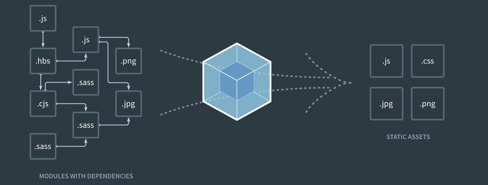

# webpack 是什么？

webpack是一种前端打包工具，基于node和npm环境

先上官图：



webpack的用意是bundle

+ Bundle your assets
+ Bundle your images
+ Bundle your scripts
+ Bundle your styles

最简单的例子就是打包模块化js，让页面只需引入一个js即可

E.g.

原本模块化代码:

**src/index.js**

```javascript
import hello from './hello.js';

hello('showDom');
```

**src/hello.js**

```javascript
export default function hello(domId) {
    document.getElementById(domId).innerHTML = "Hello guys~";
}
```

用于打包的webpack配置文件:

**./webpack.config.js**

```javascript
module.exports = {
    entry: './src/index.js',
    output: {
        path: __dirname+ '/build',
        filename: 'bundle.js'
    }
};
```

然后通过webpack打包后生成了`./build/bundle.js`文件

**index.html**

```html
<!DOCTYPE html>
<html>
    <head>
        ....
    </head>
    <body>
        ....
        <span id = "showDom"></span>
        ....
    </body>
    <script type = "text/javascript" src = "build/bundle.js"></script>
</html>
```

`index.html`页面只需引入`./build/bundle.js`文件，即相当于引入了`index.js`和`hello.js`的效果，并且`index.js`和`hello.js`还是用了ES6的`import`和`export`语句。