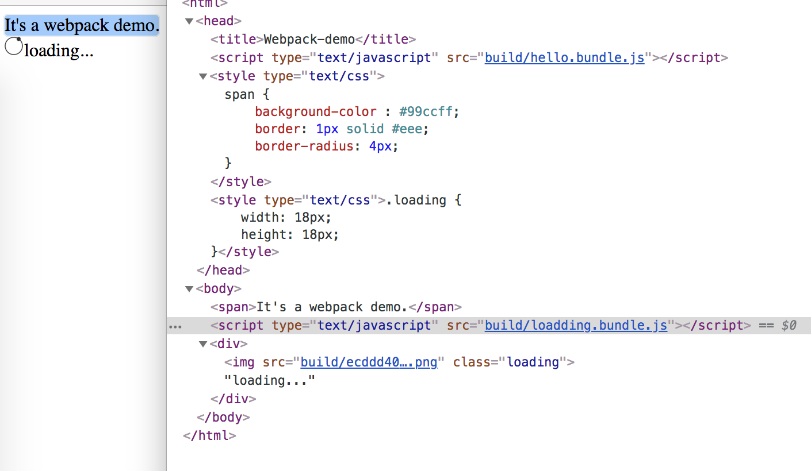

# 输出管理

> 该笔记的案例代码继承了上一篇[资源管理](./3-资源管理.md)笔记。

当然之前只是webpack输出一个文件，在实际项目中那些想要复用组件并且更新升级的话会显得很麻烦。当然webpack也支持bundle多个输出。


## 准备另一份需要打包文件

```diff
  ./demo-webpack
  ├── build
- │   ├── bundle.js
- │   ├── bundle.js.map
- │   └── ecddd40a6d3dae6abdb22126fee4c925.png
  ├── index.html
- ├── index.js
  ├── node_modules
  │   └── ....
  ├── package-lock.json
  ├── package.json
  ├── src
+ │   ├── hello-component
+ │   │   ├── hello.js
+ │   │   └── span.css
+ │   ├── index-hello.js
+ │   ├── index-loadding.js
+ │   └── loadding-component
+ │       ├── loadding.css
+ │       └── loading.png  
- │   ├── hello.js
- │   ├── loading.png
- │   └── span.css
  └── webpack.config.js
```

将原来的`index.js`文件移除拆分为`hello-component`和`loadding-component`模块，然后要分开打包的文件为`index-hello.js`和`index-loadding.js`文件，清理`/build`目录。

**src/index-hello.js**

```javascript
import hello from './hello-component/hello.js';
import './hello-component/span.css';

hello();
```

**src/index-loadding.js**

```javascript
import loadingIcon from './loadding-component/loading.png';
import './loadding-component/loadding.css';

(()=>{
	let loadingDiv = document.createElement('div');
	let loadingImage = new Image();
	loadingImage.src = loadingIcon;
	loadingDiv.appendChild(loadingImage);
	loadingImage.classList.add('loading');
	loadingDiv.innerHTML += 'loading...';
	document.body.appendChild(loadingDiv);
})();
```


## 修改配置文件

**webpack.config.js**

```diff
  module.exports = {
  	devtool: 'source-map',
- 	entry: './index.js',
+ 	entry: {
+ 		loadding: './src/index-loadding.js',
+ 		hello: './src/index-hello.js'
+ 	},
    output: {
      	path: __dirname + '/build',
      	publicPath: 'build/',
-     	filename: 'bundle.js'
+ 		filename: '[name].bundle.js'
  	},
  	module: {
  		rules: [
  			{ test: /\.css$/, use: [ 'style-loader', 'css-loader'] },
  			{ test: /\.(jpg|gif|png|svg)$/, use: ['file-loader'] }
  		]
  	}
  };
```

## 打包测试

执行`npm run build`打包

打包成功后目录会多出如下文件：

```diff
  ./demo-webpack
  ├── build
+ │   ├── ecddd40a6d3dae6abdb22126fee4c925.png
+ │   ├── hello.bundle.js
+ │   ├── hello.bundle.js.map
+ │   ├── loadding.bundle.js
+ │   └── loadding.bundle.js.map
  ├── index.html
  ├── node_modules
  │   └── ....
  ├── package-lock.json
  ├── package.json
  ├── src
  │   ├── hello-component
  │   │   ├── hello.js
  │   │   └── span.css
  │   ├── index-hello.js
  │   ├── index-loadding.js
  │   ├── loadding-component
  │   │   ├── loadding.css
  │   │   └── loading.png
  │   └── span.css
  └── webpack.config.js
```

测试:

**index.html**

```diff
  <!DOCTYPE>
  <html>
  	<head>
  		<title>Webpack-demo</title>
+ 		<script type="text/javascript" src = "build/hello.bundle.js"></script>
  	</head>
  	<body>
  		<span>It's a webpack demo.</span>
  	</body>
- 	<script type="text/javascript" src = "build/bundle.js"></script>
+ 	<script type="text/javascript" src = "build/loadding.bundle.js"></script>
  </html>
```



如上图测试结果正常。

## 扩展 - 清理build/dist 目录插件

**webpack**可以配置**插件**，可以让打包变得更加快速便捷

在webpack打包的时候，如果需要，总是得手动去清理旧的的`/build` 或者 `/dist` 目录，但是可以使用插件来在每一次打包的时候先清理。

+ **安装插件**

  执行`npm install --save-dev clean-webpack-plugin`命令

+ **修改webpack.config.js**

  ```diff
  + const CleanWebPackPlugin = require('clean-webpack-plugin');
    
    module.exports = {
    	devtool: 'source-map',
    	entry: {
    		loadding: './src/index-loadding.js',
    		hello: './src/index-hello.js'
    	},
        output: {
        	path: __dirname + '/build',
        	publicPath: 'build/',
        	filename: '[name].bundle.js'
    	},
    	module: {
    		rules: [
    			{ test: /\.css$/, use: [ 'style-loader', 'css-loader'] },
    			{ test: /\.(jpg|gif|png|svg)$/, use: ['file-loader'] }
    		]
    	},
  + 	plugins: [ new CleanWebPackPlugin('build') ]
    };
   
  ```

+ 打包执行

  若成功出现如下信息，则表示该清理插件正常执行

  