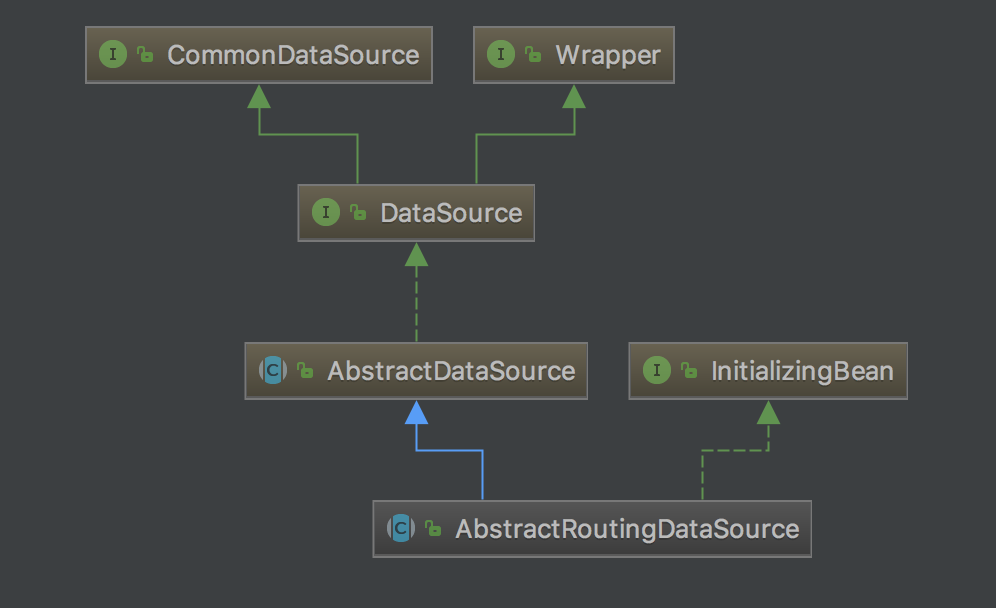

#AbstractRoutingDataSource 解析

Spring 的`spring-jdbc`模块提供了一个可以实现动态数据库的类`AbstractRoutingDataSource`。

## 继承关系

如图：



由此可见`AbstractRoutingDataSource` 实际上是继承了`AbstarctDataSource`并实现了`DataSource`接口，因此我们只要写一个类继承它，就能作为一个数据源配置到程序当中去。


##源码解析

可以快速略一遍

```java
/*
 * Copyright 2002-2012 the original author or authors.
 *
 * Licensed under the Apache License, Version 2.0 (the "License");
 * you may not use this file except in compliance with the License.
 * You may obtain a copy of the License at
 *
 *      http://www.apache.org/licenses/LICENSE-2.0
 *
 * Unless required by applicable law or agreed to in writing, software
 * distributed under the License is distributed on an "AS IS" BASIS,
 * WITHOUT WARRANTIES OR CONDITIONS OF ANY KIND, either express or implied.
 * See the License for the specific language governing permissions and
 * limitations under the License.
 */

package org.springframework.jdbc.datasource.lookup;

import java.sql.Connection;
import java.sql.SQLException;
import java.util.HashMap;
import java.util.Map;
import javax.sql.DataSource;

import org.springframework.beans.factory.InitializingBean;
import org.springframework.jdbc.datasource.AbstractDataSource;
import org.springframework.util.Assert;

/**
 * Abstract {@link javax.sql.DataSource} implementation that routes {@link #getConnection()}
 * calls to one of various target DataSources based on a lookup key. The latter is usually
 * (but not necessarily) determined through some thread-bound transaction context.
 *
 * @author Juergen Hoeller
 * @since 2.0.1
 * @see #setTargetDataSources
 * @see #setDefaultTargetDataSource
 * @see #determineCurrentLookupKey()
 */
public abstract class AbstractRoutingDataSource extends AbstractDataSource implements InitializingBean {

	private Map<Object, Object> targetDataSources;

	private Object defaultTargetDataSource;

	private boolean lenientFallback = true;

	private DataSourceLookup dataSourceLookup = new JndiDataSourceLookup();

	private Map<Object, DataSource> resolvedDataSources;

	private DataSource resolvedDefaultDataSource;


	/**
	 * Specify the map of target DataSources, with the lookup key as key.
	 * The mapped value can either be a corresponding {@link javax.sql.DataSource}
	 * instance or a data source name String (to be resolved via a
	 * {@link #setDataSourceLookup DataSourceLookup}).
	 * <p>The key can be of arbitrary type; this class implements the
	 * generic lookup process only. The concrete key representation will
	 * be handled by {@link #resolveSpecifiedLookupKey(Object)} and
	 * {@link #determineCurrentLookupKey()}.
	 */
	public void setTargetDataSources(Map<Object, Object> targetDataSources) {
		this.targetDataSources = targetDataSources;
	}

	/**
	 * Specify the default target DataSource, if any.
	 * <p>The mapped value can either be a corresponding {@link javax.sql.DataSource}
	 * instance or a data source name String (to be resolved via a
	 * {@link #setDataSourceLookup DataSourceLookup}).
	 * <p>This DataSource will be used as target if none of the keyed
	 * {@link #setTargetDataSources targetDataSources} match the
	 * {@link #determineCurrentLookupKey()} current lookup key.
	 */
	public void setDefaultTargetDataSource(Object defaultTargetDataSource) {
		this.defaultTargetDataSource = defaultTargetDataSource;
	}

	/**
	 * Specify whether to apply a lenient fallback to the default DataSource
	 * if no specific DataSource could be found for the current lookup key.
	 * <p>Default is "true", accepting lookup keys without a corresponding entry
	 * in the target DataSource map - simply falling back to the default DataSource
	 * in that case.
	 * <p>Switch this flag to "false" if you would prefer the fallback to only apply
	 * if the lookup key was {@code null}. Lookup keys without a DataSource
	 * entry will then lead to an IllegalStateException.
	 * @see #setTargetDataSources
	 * @see #setDefaultTargetDataSource
	 * @see #determineCurrentLookupKey()
	 */
	public void setLenientFallback(boolean lenientFallback) {
		this.lenientFallback = lenientFallback;
	}

	/**
	 * Set the DataSourceLookup implementation to use for resolving data source
	 * name Strings in the {@link #setTargetDataSources targetDataSources} map.
	 * <p>Default is a {@link JndiDataSourceLookup}, allowing the JNDI names
	 * of application server DataSources to be specified directly.
	 */
	public void setDataSourceLookup(DataSourceLookup dataSourceLookup) {
		this.dataSourceLookup = (dataSourceLookup != null ? dataSourceLookup : new JndiDataSourceLookup());
	}


	@Override
	public void afterPropertiesSet() {
		if (this.targetDataSources == null) {
			throw new IllegalArgumentException("Property 'targetDataSources' is required");
		}
		this.resolvedDataSources = new HashMap<Object, DataSource>(this.targetDataSources.size());
		for (Map.Entry<Object, Object> entry : this.targetDataSources.entrySet()) {
			Object lookupKey = resolveSpecifiedLookupKey(entry.getKey());
			DataSource dataSource = resolveSpecifiedDataSource(entry.getValue());
			this.resolvedDataSources.put(lookupKey, dataSource);
		}
		if (this.defaultTargetDataSource != null) {
			this.resolvedDefaultDataSource = resolveSpecifiedDataSource(this.defaultTargetDataSource);
		}
	}

	/**
	 * Resolve the given lookup key object, as specified in the
	 * {@link #setTargetDataSources targetDataSources} map, into
	 * the actual lookup key to be used for matching with the
	 * {@link #determineCurrentLookupKey() current lookup key}.
	 * <p>The default implementation simply returns the given key as-is.
	 * @param lookupKey the lookup key object as specified by the user
	 * @return the lookup key as needed for matching
	 */
	protected Object resolveSpecifiedLookupKey(Object lookupKey) {
		return lookupKey;
	}

	/**
	 * Resolve the specified data source object into a DataSource instance.
	 * <p>The default implementation handles DataSource instances and data source
	 * names (to be resolved via a {@link #setDataSourceLookup DataSourceLookup}).
	 * @param dataSource the data source value object as specified in the
	 * {@link #setTargetDataSources targetDataSources} map
	 * @return the resolved DataSource (never {@code null})
	 * @throws IllegalArgumentException in case of an unsupported value type
	 */
	protected DataSource resolveSpecifiedDataSource(Object dataSource) throws IllegalArgumentException {
		if (dataSource instanceof DataSource) {
			return (DataSource) dataSource;
		}
		else if (dataSource instanceof String) {
			return this.dataSourceLookup.getDataSource((String) dataSource);
		}
		else {
			throw new IllegalArgumentException(
					"Illegal data source value - only [javax.sql.DataSource] and String supported: " + dataSource);
		}
	}


	@Override
	public Connection getConnection() throws SQLException {
		return determineTargetDataSource().getConnection();
	}

	@Override
	public Connection getConnection(String username, String password) throws SQLException {
		return determineTargetDataSource().getConnection(username, password);
	}

	@Override
	@SuppressWarnings("unchecked")
	public <T> T unwrap(Class<T> iface) throws SQLException {
		if (iface.isInstance(this)) {
			return (T) this;
		}
		return determineTargetDataSource().unwrap(iface);
	}

	@Override
	public boolean isWrapperFor(Class<?> iface) throws SQLException {
		return (iface.isInstance(this) || determineTargetDataSource().isWrapperFor(iface));
	}

	/**
	 * Retrieve the current target DataSource. Determines the
	 * {@link #determineCurrentLookupKey() current lookup key}, performs
	 * a lookup in the {@link #setTargetDataSources targetDataSources} map,
	 * falls back to the specified
	 * {@link #setDefaultTargetDataSource default target DataSource} if necessary.
	 * @see #determineCurrentLookupKey()
	 */
	protected DataSource determineTargetDataSource() {
		Assert.notNull(this.resolvedDataSources, "DataSource router not initialized");
		Object lookupKey = determineCurrentLookupKey();
		DataSource dataSource = this.resolvedDataSources.get(lookupKey);
		if (dataSource == null && (this.lenientFallback || lookupKey == null)) {
			dataSource = this.resolvedDefaultDataSource;
		}
		if (dataSource == null) {
			throw new IllegalStateException("Cannot determine target DataSource for lookup key [" + lookupKey + "]");
		}
		return dataSource;
	}

	/**
	 * Determine the current lookup key. This will typically be
	 * implemented to check a thread-bound transaction context.
	 * <p>Allows for arbitrary keys. The returned key needs
	 * to match the stored lookup key type, as resolved by the
	 * {@link #resolveSpecifiedLookupKey} method.
	 */
	protected abstract Object determineCurrentLookupKey();

}

```

那么既然是`DataSource`那就最值的关注的就是获取数据库连接`getConection()`的实现：

```java
@Override
public Connection getConnection() throws SQLException {
    return determineTargetDataSource().getConnection();
}

@Override
public Connection getConnection(String username, String password) throws SQLException {
    return determineTargetDataSource().getConnection(username, password);
}
```

`getConnection`很简单,是调用了`determineTargetDataSource()`方法返回的数据源提供的`Connection`对象

然后继续看`determineTargetDataSource()`

```java
	/**
	 * Retrieve the current target DataSource. Determines the
	 * {@link #determineCurrentLookupKey() current lookup key}, performs
	 * a lookup in the {@link #setTargetDataSources targetDataSources} map,
	 * falls back to the specified
	 * {@link #setDefaultTargetDataSource default target DataSource} if necessary.
	 * @see #determineCurrentLookupKey()
	 */
	protected DataSource determineTargetDataSource() {
        //当this.resolvedDataSources不为null时候抛出异常
		Assert.notNull(this.resolvedDataSources, "DataSource router not initialized");
        //获取key
		Object lookupKey = determineCurrentLookupKey();
        //通过Key获取datasource
		DataSource dataSource = this.resolvedDataSources.get(lookupKey);
        //如果获取不到datasouce则采用this.resolvedDefaultDataSource数据源
        //若this.lenientFallback为true的时候，则不管有没有key，总会采用this.resolvedDefaultDataSource数据源
		if (dataSource == null && (this.lenientFallback || lookupKey == null)) {
			dataSource = this.resolvedDefaultDataSource;
		}
        //获取数据源失败抛出异常
		if (dataSource == null) {
			throw new IllegalStateException("Cannot determine target DataSource for lookup key [" + lookupKey + "]");
		}
		return dataSource;
	}
```

通过源码以及注释，可以不难看出实际上数据源`DataSource`获取有两种方式：

+ 从`this.resolvedDataSources(Map<Object,Datasource>)`中获取
+ 从`this.resolvedDefaultDataSource (DataSource)`获取

当从Map中获取失败时候，则采用默认数据源。

但是从Map中获取数据源的时候，最关键的一步就是如下：

```java
//获取从Map数据源中对应的Key
Object lookupKey = determineCurrentLookupKey();
```

则我们看一下源码：

```java
	/**
	 * Determine the current lookup key. This will typically be
	 * implemented to check a thread-bound transaction context.
	 * <p>Allows for arbitrary keys. The returned key needs
	 * to match the stored lookup key type, as resolved by the
	 * {@link #resolveSpecifiedLookupKey} method.
	 */
	protected abstract Object determineCurrentLookupKey();
```

它是一个抽象方法，看来获取数据库连接里面是我们最需要关心的就是如何获得key的这个方法，这个key决定了获得的`Connection`是从哪个`DataSource`中获得。

获取数据源的key知道了可以通过继承重写实现来操控外，我们还需了解的是储存数据源集合的`resolvedDataSources`这个`Map`对象:

```java
private Map<Object, DataSource> resolvedDataSources;
```

通过关键字我们从源码中找到如下代码：

```java
@Override
public void afterPropertiesSet() {
    if (this.targetDataSources == null) {
        throw new IllegalArgumentException("Property 'targetDataSources' is required");
    }
    //新建实例
    this.resolvedDataSources = new HashMap<Object, DataSource>(this.targetDataSources.size());
    //遍历 this.targetDataSources
    for (Map.Entry<Object, Object> entry : this.targetDataSources.entrySet()) {
        //获取LookupKey
        Object lookupKey = resolveSpecifiedLookupKey(entry.getKey());
        //获取dataSource
        DataSource dataSource = resolveSpecifiedDataSource(entry.getValue());
        //将lookupKey通过键值对方式储存到 resolvedDataSources 中
        this.resolvedDataSources.put(lookupKey, dataSource);
    }
    // 设置默认datasource
    if (this.defaultTargetDataSource != null) {
        this.resolvedDefaultDataSource = resolveSpecifiedDataSource(this.defaultTargetDataSource);
    }
}
```

从上面中我们可以看到，用于切换数据源的`resolvedDataSources`是`Map`对象是由`this.targetDataSources`处理后填充的。

然后对于`this.targetDataSources`却没有任何处理，只有`setter`方法，连`getter`方法都没有。看来是由Spring实例该Bean我们外部手动注入。

```java
/**
	 * Specify the map of target DataSources, with the lookup key as key.
	 * The mapped value can either be a corresponding {@link javax.sql.DataSource}
	 * instance or a data source name String (to be resolved via a
	 * {@link #setDataSourceLookup DataSourceLookup}).
	 * <p>The key can be of arbitrary type; this class implements the
	 * generic lookup process only. The concrete key representation will
	 * be handled by {@link #resolveSpecifiedLookupKey(Object)} and
	 * {@link #determineCurrentLookupKey()}.
	 */
public void setTargetDataSources(Map<Object, Object> targetDataSources) {
    this.targetDataSources = targetDataSources;
}
```

接下来我们先来看下`lookuKey`是怎么处理生成的：

```java
/**
	 * Resolve the given lookup key object, as specified in the
	 * {@link #setTargetDataSources targetDataSources} map, into
	 * the actual lookup key to be used for matching with the
	 * {@link #determineCurrentLookupKey() current lookup key}.
	 * <p>The default implementation simply returns the given key as-is.
	 * @param lookupKey the lookup key object as specified by the user
	 * @return the lookup key as needed for matching
	 */
protected Object resolveSpecifiedLookupKey(Object lookupKey) {
    return lookupKey;
}
```

内容很简单，没有做任何处理，直接返回，但是我们可以通过重载此方法来定制生成我们所需的`lookpKey`。

我们再来看看作为`Map`的`value`数据源`DataSource`是如何生成处理的

```java
/**
	 * Resolve the specified data source object into a DataSource instance.
	 * <p>The default implementation handles DataSource instances and data source
	 * names (to be resolved via a {@link #setDataSourceLookup DataSourceLookup}).
	 * @param dataSource the data source value object as specified in the
	 * {@link #setTargetDataSources targetDataSources} map
	 * @return the resolved DataSource (never {@code null})
	 * @throws IllegalArgumentException in case of an unsupported value type
	 */
protected DataSource resolveSpecifiedDataSource(Object dataSource) throws IllegalArgumentException {
    //若dataSource直接是DataSouce实例则不做处理，直接返回
    if (dataSource instanceof DataSource) {
        return (DataSource) dataSource;
    }
    else if (dataSource instanceof String) {
        //若dataSource是String类型，从dataSourceLookup中获取
        return this.dataSourceLookup.getDataSource((String) dataSource);
    }
    else {
        throw new IllegalArgumentException(
            "Illegal data source value - only [javax.sql.DataSource] and String supported: " + dataSource);
    }
}

```

我们发现如果传入的参数`Object datasource`只适合两种类型：`DataSource` 和`String`

当是`DataSource`实例则不做任何处理，若是`String`则通过`dataSourceLookup`对象获得。

到此处，可以不用深究`dataSourceLookup`的来源了。毕竟，这只是个Abstract抽象类。可以由我们实例化来注入`targetDataSources`属性来确保`Object dataSource`参数一定是`DataSource`实例就行。


关于`InitializingBean`:

> 说一下`afterPorpertiesSet()`是`InitializingBean`接口方法是Spring的Bean的生命周期的一环。
>
> 源码如下：
>
> ```java
> package org.springframework.beans.factory;
>
> public interface InitializingBean {
>     void afterPropertiesSet() throws Exception;
> }
> ```
>
> 在Spring构建该Bean的时候的，该方法会在该Bean属性注入结束之后执行（字面意思afterPropertiesSet）。
>
> 所以在项目启动Spring构建该Bean的实例时会自动执行该方法。

