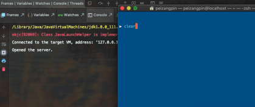
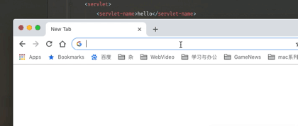
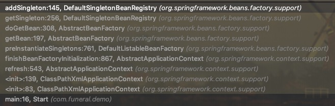
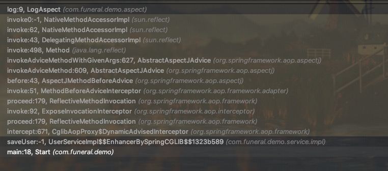
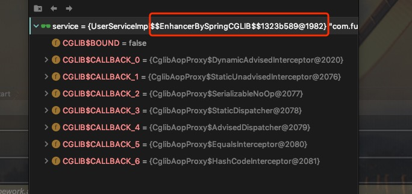

# 知识梳理

> 写在最前：
>
> 这是给我自己脑子里的技术和知识的一个整理Note。就是随手记。只是为了理清思路而已。并不会在各处写的很详细。每篇内容也很少，主要是为了牵引下一个知识点存在的。
>
> **PS**：里面有很多代码都是自己想到什么写什么。甚至很多都没有自己去运行过。而且为了只表达核心意思的时候，不会去额外添加关于**异常处理**、**稳定性**和**异步访问**等处理代码，以及案例当中的`lib`(依赖包)也不会做说明。
>
> 如果你刚好看到了篇内容，觉得对你有帮助的话那我也会很高兴的。


# Java 程序

## 基础

> **前置要求：JAVA基础知识**

计算机执行程序是从一个入口方法(main)再到方法执行，然后执行完毕结束。

```java
public class App(){
    public static void main(String args[]){
        System.out.println('Process program complete!');
    }
}
```

这是一句非常基础的代码。编译然后执行，就是这个代码的实际用处。

```bash
$javac App.java
$java App
Process Program complete!
```

然后我们需要程序能够通过输入，然后回应我们的操作。

```java
import java.util.Scanner;

public class App {
    public static void main(String[] args) {
        System.out.print("Please type something:");
        Scanner sc = new Scanner(System.in);
        System.out.println("You inputted \""+sc.next()+"\".");
        System.out.println("Process program complete!");
    }
}

/*
 * 执行结果：
 * Please type something: Hello
 * You inputted "Hello".
 * Process program complete!
 */
```

## 循环

但是，我们需要一个程序能够保持运行，一直等待我们输入，直到我们让它结束(stop)为止。比如操作系统，Web程序等。

```java
import java.util.Scanner;

public class App {
    public static void main(String[] args) {
        Scanner sc = new Scanner(System.in);
        String input = null;
        do{
            System.out.print("Please type something:");
            input = sc.next();
            System.out.println("You inputted \"" + input+ "\".");
        } while( !"stop".equals(input) );
        System.out.println("Process program complete");
    }
}

/*
 * 执行结果：
 * Please type something:Hello
 * You inputted "Hello".
 * Please type something:World
 * You inputted "World".
 * Please type something:stop
 * You inputted "stop".
 * Process program complete
 */
```

这个大概就是操作系统等持续运行程序的原理了。

## Web

Web应用程序是一种可以通过Web访问的应用程序，程序的最大好处是用户很容易访问应用程序。Web程序是通过HTTP协议进行网络访问的。

### Http

> **前置要求：HTTP协议知识**

```java
import java.io.IOException;
import java.io.OutputStream;
import java.net.ServerSocket;
import java.net.Socket;

public class App {

    public static void main(String[] args) {
        try {
            server();
        } catch (IOException e) {
            e.printStackTrace();
        }
    }

    private static void server() throws IOException {
        ServerSocket server = new ServerSocket(4403);

        System.out.print("Opened the server.");
        //监听端口并且处理,如果未接受到访问请求，程序就一直暂停在此处
        Socket socket = server.accept();
        //接收到请求后处理的
        socketHandler(socket);
        System.out.println("Received a request!");
        //关闭此访问连接
        socket.close();
        //关闭服务器
        server.close();
        System.out.println("Closed the server.");

    }

    private static void socketHandler(Socket socket) throws IOException{
        //调出输出流
        OutputStream out = socket.getOutputStream();
        //将信息返回给客户端。
        out.write("Access was successful!".getBytes());
        //输出数据给客户端。
        out.flush();
    }
}

```

运行结果：



但是每次要执行Http服务的构建，还要处理多个用户同时访问，那将管理非常麻烦。这时候我们就需要Tomcat了

Tomcat又是什么？Tomcat是Web容器。那什么是Web容器？

为了更好的处理这类HTTP请求，能够归类，统一这些Web程序。Web容器就出现了。

你只需把Web程序丢到Web容器里，就自然能够享受到便利的Web容器提供的Servlet接口，我们的Web程序只需要处理响应请求这个过程即可。什么HTTP协议、服务等都不需要在意。

### web.xml

> **前置要求：Java Web知识**

这时候我们只需要web.xml来配置servlet了

```txt
.
├── src
│   └── com
│       └── funeral
│           └── web
│               └── appserver
│                   └── HelloAction.java
└── web
    └── WEB-INF
        └── web.xml
```

**HelloAction.java**

```java
package com.funeral.web.appserver;

import javax.servlet.ServletException;
import javax.servlet.http.HttpServlet;
import javax.servlet.http.HttpServletRequest;
import javax.servlet.http.HttpServletResponse;
import java.io.IOException;
import java.io.PrintWriter;

/**
 * @author FuneralObjects
 * CreateTime 2018/11/19 5:18 PM
 */
public class HelloAction extends HttpServlet {
    @Override
    protected void doGet(HttpServletRequest req, HttpServletResponse resp) throws ServletException, IOException {
        PrintWriter writer = resp.getWriter();
        writer.println("Access was Successful.");
        writer.flush();
        writer.close();
    }
}
```

**web.xml**

```xml
<?xml version="1.0" encoding="UTF-8"?>
<web-app xmlns="http://xmlns.jcp.org/xml/ns/javaee"
         xmlns:xsi="http://www.w3.org/2001/XMLSchema-instance"
         xsi:schemaLocation="http://xmlns.jcp.org/xml/ns/javaee http://xmlns.jcp.org/xml/ns/javaee/web-app_4_0.xsd"
         version="4.0">
    <servlet>
        <servlet-name>hello</servlet-name>
        <servlet-class>com.funeral.web.appserver.HelloAction</servlet-class>
    </servlet>
    <servlet-mapping>
        <servlet-name>hello</servlet-name>
        <url-pattern>/hello</url-pattern>
    </servlet-mapping>
</web-app>
```

运行结果：



> 当业务变得越来越多的时候，MVC框架就出现了。
>
> 简单的来说各类`MVC`框架都有几个共同特性：解决web访问的各类协议配置以及数据装配问题，然你更加专注于业务的内容。
>
> 比如：`Strust`、`Spring-MVC`等


# AOP

AOP是什么？

AOP是面向切面编程，通过预编译方式和运行期动态代理实现程序功能的统一维护的一种技术 -- 来自百度百科。

什么是面向切面编程呢？按照我的理解，就是面向“方法”编程，针对某个方法进行去编程。

我用`javascript`做个简单的例子

```javascript
//这是一个submit的方法
function submit(){
    let result = 'success';
    console.info("processing submit..");
    return result;
}
function logPrint( needLog ){
    console.log("processing prev-log...");
    let result = needLog();
    console.log("processing post-log...");
    console.log("Submit's result:",result);
    return result;
}
//执行
let submitResult = logPrint( submit );
```

------

执行结果：

```txt
processing prev-log...
processing submit..
processing post-log...
Submit's result: success
```

我认为这可以是作为很简单的AOP案例，因为`logPrint()`就是针对 `submit()`进行的编程。在`submit()` `prev`(执行前)进行一部分操作，在`post`(执行后)进行一部分操作。也就是`logPrint`代理了`submit()`的执行。


# 设计模式

##工厂

> 顾名思义，当我们需要批量化生产特定一种或几种产品的时候，我们会在工厂建立该产品的生产线批量生产。

在程序中，我们需要大量特定一种或者几种「统一类型」的对象时候，建立“工厂”类和其“生产线”方法，在使用的时候，代码中能比较好控制以及逻辑。

有一个Cuboid类

```java
public class Cuboid{
    private int length;
    private int height;
    private int width;
    
    public Cuboid(int length, int height, int width){
        this.length = length;
        this.height = height;
        this.width = width;
    }
}
```

在实际业务中，我可能要用这个类创建只要边长为2(big)和1(small)的相同长宽高的Cube。

在没有工厂模式的情况下。

```java
public void useCube(Boolean flag){
    
    //service code..
    if(flag){
        Cuboid bigCube = new Cuboid(2,2,2);
        //use bigCube
    }else{
        Cuboid smallCube = new Cuboid(1,1,1);
        //use samllCube
    }
}
```

那假如使用工厂模式呢？

我们创建一个创建Cuboid对象的工厂类。

```java
public class CuboidFactory{
    public static Cuboid createCube(boolean big){
        return big? new Cuboid(2,2,2)
            : new Cuboid(1,1,1);
    }
}
```

那么在`useCube`方法中代码就能这样写：

```java
public void useCube(Boolean flag){
    Cuboid cube = CuboidFactory.createCube(flag);
    //service code..
}
```

虽然在结果上看只是简单等代码封装调用对吧？

但是在阅读代码逻辑上，会非常清楚。在其他人想使用类创建对象的时候，也不容易因为不熟悉其对象属性意义而苦恼。在代码维护上也会更加方便。


## 单例

当在整个程序中，你希望所有线程只能使用同一个对象的时候。就该用此模式了。

比如一个单例时间对象，在允许损失一定的精度的情况下用来替代`System.currentMills()`调用

> 这个方法是加了同步锁的，异步大量访问的时候会很慢）

```java
package com.sicilin.core.util;

import com.sicilin.core.dto.TimePeriodDTO;
import com.sicilin.core.exception.ParamValidateException;

import java.text.SimpleDateFormat;
import java.util.ArrayList;
import java.util.Calendar;
import java.util.Date;
import java.util.List;

/**
 * 时间工具类
 */
public class TimeUtils {
    /**
     * 刷新频率毫秒
     */
    private long rate;
    /**
     * 当前时间
     */
    private long now;
    /**
     * 不可改变地址的静态对象
     */
    public final static TimeUtils timeUtils = new TimeUtils(10);
    
    /**
     * 私有化构造方法，使之外借无法随意创建该类对象
     */
    private TimeUtils(final long rate){
        this.rate = rate;
        this.now = System.currentTimeMillis();
        Runnable runnable = new Runnable() {
            @Override
            public void run() {
                refresh();
            }
        };
        Thread thread = new Thread(runnable);
        thread.start();
    }


    /**
     * 无限刷新
     */
    private void refresh(){
        boolean flag = true;
        while (flag) {
            try {
                Thread.sleep(rate);
            } catch (InterruptedException e) {
                flag = false;
            }
            now = System.currentTimeMillis();
        }
    }

    public static long getNow() {
        return timeUtils.now;
    }

    public static long getRate() {
        return timeUtils.rate;
    }
}

```

上面案例中最主要的是下面这部分代码

```java
//import ...
public class TimeUtils {
	//variables ...
    /**
     * 不可改变地址的静态对象
     */
    public final static TimeUtils timeUtils = new TimeUtils(10);
    
    /**
     * 私有化构造方法，使之外借无法随意创建该类对象
     */
    private TimeUtils(final long rate){
        //constructive code..
    }

   //methods ...
}
```

+ 私有化构造方法
+ 自行创建一个`final static`对象供外部使用

这样就外部无法构造`TimeUtils`对象，而且只能使用提供的`TimeUtils.timeUtils`对象。这样就实现了整个程序中只有一个`TimeUtils`对象存在。实现了单例。


## 观察者

当我们希望观察某个对象/属性或者是事件发生的时候，能够同时更新部分操作。

比如，系统里有一个公告板，当公告板内容改变的时候，我们要通知到所有正在查看公告板的用户，告诉用户公告板内容变了，刷新公告板内容。

```java
//公告板接口
public interface BulletinBoard(){
    //改变公告板内容
    void changeContent(String content);
    //连接线上用户
    void connectOnlineUser(OnlineUser user);
    //断开线上用户
    void disconnectOnlineUser(int userId);
    //通知用户
    void tellUser(String message);
}
```

```java
//线上用户接口
public interface OnlineUser(){
    //提供该用户的ID
    String getId();
    //接受被通知的信息
    void receive(String message);
}
```

---

实现`BulletinBoard`接口的`TaskBoard`(任务公告板)

```java
public class TaskBoard() implements BulletinBoard {
    private Map<String ,OnlineUser> onlineUsers = new HashMap<>();
    private String content;
    
    @Override
    public void changeContent(String content){
        this.content = content;
        //通知所有用户
        this.tellUser("TaskBoard changed content. Please reacquire its content again.")
    }
    
   	@Override
    public void connectOnlineUser(OnlineUser user){
        this.onlineUsers.put(user.getId(),user);
    }
    
    @Override
    public void disconnectOnlineUser(String userId){
        if(this.onlineUsers.containsKey(userId)){
        	this.onlineUsers.remove(userId);    
        }
    }
    
    @Override
    public void tellUser(String message){
        for(String userId: this.onlineUsers.keySet() ){
            this.onlineUsers.get(userId).receive(message);
        }
    }
}
```

实现了`OnlineUser`的`TaskUser`(任务用户)

```java
public class TaskUser implements OnlineUser{
    private String id;
    //Other variables...
    
    @Override
    public String getId(){
        return this.id;
    }
    
    @Override
    public void recive(String message){
        //print messages...
    }
}
```

这样，当`TaskBoard`对象调用`changeContent`方法的时候，所有连接该公告板的在线用户均被调用`receive`方法（相当于被通知）。


## 监听者

监听者是的原理就是观察者，只不过在灵活性比观察者好。

接下来请看案例。以下案例使用了JDK自带的`java.util.EventObject`,`java.util.EventListener`和`java.util.EventObject`.

>  主要实现效果逻辑直接看**App.java**

---

**EventHandler.java**

```java
package listener;
import java.util.EventObject;

/**
 * 作为监听到事件的处理接口
 */
public interface EventHandler {
    void handle(EventObject event);
}
```

**Listener.java**

```java
package listener;
import java.util.EventListener;

/**
 * 监听器
 */
public class Listener implements EventListener {
    private WindowEvent event;
    private EventHandler handler;

    //注册监听对象和监听到的监听后处理程序
    public void listen(WindowEvent event, EventHandler handler){
        this.event = event;
        this.handler = handler;
        this.registerToEvent();
    }

    public WindowEvent getEvent() {
        return event;
    }

    //监听到事件发生，并且执行handle
    public void listened(){
        this.handler.handle(event);
    }

    //向Event注册监听器
    private void registerToEvent(){
        this.event.addListener(this);
    }
}
```

**Event.java**

```java
package listener;
import java.util.ArrayList;
import java.util.EventObject;
import java.util.List;

/**
 * 作为Window的事件
 */
public class Event extends EventObject {
    private String name;
    private EventSource source;
    private List<Listener> listeners = new ArrayList<>();

    public Event(EventSource source, String name) {
        super(source);
        this.name = name;
        this.source = source;
        source.registerEvent(this);
    }
    //添加监听器
    void addListener(Listener listener){
        this.listeners.add(listener);
    }
    //事件行动
    void action(){
        for(Listener listener:listeners){
            listener.listened();
        }
    }
    public String getName() { return name; }

    @Override
    public EventSource getSource() { return source; }
}

```

**EventSource.java**

```java
package listener;
import java.util.HashMap;
import java.util.Map;

/**
 * 事件源
 */
public abstract class EventSource {

    private Map<String, Event> eventMap = new HashMap<>();
    //注册事件
    void registerEvent(Event event){
        eventMap.put(event.getName(),event);
    }
    //触发事件
    public EventSource trigger(String eventName){
        if(eventMap.containsKey(eventName)){
            eventMap.get(eventName).action();
        }
        return this;
    }
}
```

**Window.java**

```java
package listener;

/**
 * 作为事件源
 */
public class Window extends EventSource{
    private String name;
    public Window(String name) {
        this.name = name;
    }
    public String getName() {
        return name;
    }
}
```

**App.java**

```java
import listener.Event;
import listener.Listener;
import listener.Window;

public class App {

    public static void main(String[] args) {
        Window window = new Window("TestWindow");
        Event windowOpen = new Event(window,"open");
        Event windowClose = new Event(window,"close");

        new Listener()
                .listen(windowOpen, event -> {
                    System.out.println( windowOpen.getSource() + " opened");
                });
        new Listener()
                .listen(windowClose, event -> {
                    System.out.println( windowOpen.getSource() + " closed");
                });

        //window对象依次触发'open','close'事件
        window
                .trigger("open")
                .trigger("close");

    }
}

```

---

执行结果就是简单的输出：

```shell
listener.Window@4f3f5b24 opened
listener.Window@4f3f5b24 closed
```

> PS:
>
> 我觉得可以还可以再加个`EventController`来管理事件和事件源：
>
> ```java
> public abstract EventController{
>     public void register(EventSource source, Event event) { /* ... */}
>     public void trigger(EventSource source, String eventName) {/* ... */}
>     public void trigger(Event events) { /* ... */}
> }
> ```
>
> 因为这样能够让外部更容易的触发事件源，但是有个缺点，就是能够让外部随意的触发事件了，而不是让事件源触发，会有一定的危险性。


## 代理

对于有些接口，方法等，我们想在不侵入代码的情况下统一做一些相同的操作。将这个方法/对象代理给其他对象来执行。这样方法的控制权就在代理类上了。

> Spring-AOP也是根据`JDK/CGLIB动态代理`来实现的。

### 静态代理

这是最简单的代理。

案例：

> **UserServcie.java**
>
> ```java
> package com.funeral.demo.service;
> import com.funeral.demo.pojo.User;
> 
> /**
>  * User业务接口
>  */
> public interface UserService {
>     void saveUser(User user);
> }
> ```
>
> **UserServiceProxy.java**
>
> ```java
> package com.funeral.demo.proxy;
> import com.funeral.demo.pojo.User;
> import com.funeral.demo.service.UserService;
> 
> /**
>  * 作为UserService接口实现类的代理类。
>  */
> public class UserServiceProxy implements UserService {
>     private UserService userService;
>     @Override
>     public void saveUser(User user) {
>         System.out.println("UserServiceProxy representing "+userService);
>         this.userService.saveUser(user);
>     }
>     
>     /* consturctor, setter, getter.. */
> }
> ```
>
> 然后`UserServiceProxy`就能代理`UserService`的实现类（包括`UserServiceProxy`自己）。
>
> 在调用的时候就这样：
>
> ```java
> public static void main(){
> 	//获得UserService的实现类对象
> 	UserService service = ...
> 	UserServcieProxy proxy = new UserServcieProxy();
> 	proxy.setUserService(service);
>     //代理执行
>     proxy.saveUser(/* args */);
> }
> ```

### 动态代理

比较常用的，通用性的比较强的就是动态代理了。其原理就是根据反射来获取类字节码并即时生成代理对象。

比较常见的两种动态代理就是**`JDK`动态代理**和**`CGLIB`动态代理**

- **`JDK`动态代理**

  `JDK`中有专门一套API来实现动态代理类的

  > 案例：
  >
  > ```java
  > package com.funeral.demo.proxy;
  > import java.lang.reflect.InvocationHandler;
  > import java.lang.reflect.Proxy;
  > 
  > /**
  >  * 创建代理类
  >  */
  > public class ServiceProxy {
  >     /*
  >      * target 为需要被代理的对象
  >      * handler 为target执行方法的时候处理的程序
  >      */
  >     public static Object createProxy(Object target, InvocationHandler handler){
  >         return Proxy.newProxyInstance(target.getClass().getClassLoader(), target.getClass().getInterfaces(), handler);
  >     }
  > }
  > 
  > ```
  >
  > 调用：
  >
  > ```java
  > public class Start {
  >     public static void main(String args[]){
  >         UserService service = new UserServiceImpl();
  >         //创建service的proxy代理对象
  >         Object proxy = ServiceProxy.createProxy(service,
  >             //代理程序处理，return参数为代理方法的执行结果
  >             (proxy1, method, args1) -> {
  > 				//handler处理方法
  >             	System.out.println("Handler processing");
  >             	System.out.print(method.toString());
  >             	Object result = method.invoke(service,args1);
  >             	System.out.println("Handler has processed.");
  >             	return result;
  >         	});
  >         ((UserService)proxy).saveUser(new User("test","test"));
  >     }
  > }
  > ```
  >
  > ------
  >
  > 运行结果：
  >
  > ```txt
  > Handler processing
  > public abstract void com.funeral.demo.service.UserService.saveUser(com.funeral.demo.pojo.User)User{username='test', password='test'}
  > SUCCESS
  > Handler has processed.
  > ```

- **`CGLIB`动态代理**

  > `CGLIB`是什么？
  >
  > [WIKI](https://github.com/cglib/cglib/wiki)
  >
  > `Cglib`是一个功能强大、高性能和高质量的代码生成库，用于扩展Java类并在运行时实现接口。
  >
  > 由于`CGLIB`底层采用了`ASM`——这是一种操作`JAVA`字节码框架。从而能直接在`Runtime`运行期动态生成class。

  `JDK`原生的动态代理只能代理被实现接口的类，而且代理也只是接口的方法。无法代理没有没有实现的接口的类，但是`CGLIB`实现了对没有接口的类进行动态代理。

  > 案例：
  >
  > ```java
  > package com.funeral.demo.proxy;
  > 
  > import net.sf.cglib.proxy.Enhancer;
  > import net.sf.cglib.proxy.MethodInterceptor;
  > 
  > /**
  >  * CglibProxy
  >  */
  > public class ProxyWithCGLib {
  >     //创建代理对象
  >     public static Object createProxy(Object target, MethodInterceptor interceptor){
  >         Enhancer enhancer = new Enhancer();
  >         enhancer.setSuperclass(target.getClass());
  >         //设置callback
  >         enhancer.setCallback(interceptor);
  >         return  enhancer.create();
  >     }
  > }
  > ```
  >
  > 调用：
  >
  > ```java
  > public class Start {
  >     public static void main(String args[]){
  >         UserService service = new UserServiceImpl();
  >         //创建service的proxy代理对象
  > 		Object cglibProxy = ProxyWithCGLib.createProxy(service,(target,method,args2,methodProxy) ->{
  >             System.out.println("Interceptor started.");
  >             Object result = methodProxy.invokeSuper(target,args2);
  >             System.out.println("Interceptor finished.");
  >             return result;
  >         });
  >         ((UserService)cglibProxy).saveUser(new User("test","test"));
  >     }
  > }
  > 
  > 
  > ```
  >
  > ------
  >
  > 运行结果：
  >
  > ```txt
  > Interceptor started.
  > User{username='test', password='test'}
  > SUCCESS
  > Interceptor finished.
  > ```


# Frameworks

> 程序猿是一种及其懒惰的生物，能有现成可用的就**copy and paste**
>
> 框架的出现就是为了能够更懒惰的开发程序而存在的东西，一次开发终生受用的东西。

## Spring

[Spring 官文介绍](https://docs.spring.io/spring/docs/current/spring-framework-reference/overview.html)

### Spring-core

为什么需要Spring?

> 当`JAVA`快速发展的时候，如雨后春笋般各种各样小插件，小框架被创造出来。但是整合和使用这些插件/框架反而成了一件很麻烦的事情。
>
> 比如有一个`CompanyUserServie`类
>
> **CompanyUserServie.java**
>
> ```java
> public class CompanyUserServie{
>     public void saveCompanyUser(String username,String password){
>         CompanyUserDao companyUserDao = new CompanyUserDao(/** construction args**/);
>         companyUserDao.save(username,password);
>     }
> }
> ```
>
> 这个方式有个问题，那就是要自己构造`CompanyUserDao`对象，如果有很多Service,比如`CompanyUserServie1`、`CompanyUserServie2`..都用了呢？这样的话，万一重新修改了`CompanyUserDao`的构造方式。就要全部重新修改创建`CompanyUserDao`对象的代码。还有就是，再使用过程中，会造成多个相同的`CompanyUserDao`对象，占用并且浪费内存。
>
> ------
>
> 那改用注入(`set`)的方式不就好了？
>
> **CompanyUserServie.java**
>
> ```java
> public class CompanyUserServie{
>     private CompanyUserDao companyUserDao;
>     public void saveCompanyUser(String username,String password){
>         this.companyUserDao.save(username,password);
>     }
>     
>     public void setCompanyUserDao(CompanyUserDao companyUserDao){
>         this.companyUserDao = companyUserDao;
>     }
> }
> ```
>
> 这样使用的时候就是如下：
>
> ```java
> public static void main(String args[]){
>     CompanyUserDao dao = new CompanyUserDao(/* construction args ...*/);
>     CompanyUserService service = new CompanyUserService(/* construction args ...*/);
>     service.setCompanyUserDao(dao);
>     //service.saveCompany...
> }
> ```
>
> 虽然解决了`CompanyUserDao`的注入引用问题。但是引起了新的问题：`CompanyUserService`在被创建对象的时候，同时也要赋予`ComapnyUserDao`对象。而且`ComapnyUserService`再被调用的时候也需要被管理。
>
> > 注意，这里也有一个很重要的概念：**控制反转**
> >
> > 就原来在`CompanyUserService`中主动`new`的`CompanyUserDao`对象改为`set`注入使用，也就是，把`CompanyUserServie`中的`CompanyUserDao`对象交给了外部控制管理。而不是在自己内部管理里了。
>
> ------
>
> 那我专门写一个单例类，用来管理和装配/注入各类`JavaBean`呢？
>
> **BeanManager.java**
>
> ```java
> public class BeanManager{
>     private Map<String,Object> beans;
>     private static final BeanManager beanManager = new BeanManager();
>     private BeanManager(){
>         beans = new HashMap();
>         beans.put("companyUserDao",new CompanyUserDao(/* construction args... */));
>         beans.put("companyUserService",new CompanyUserService(/* construction args... */));
>     };
>     
>     public static Object getBean(String name){
>         return beanManager.get(name);
>     }
>     
> }
> ```
>
> `CompanyUserService`中需要的注入的对象，交给`BeanManager`提供
>
> **CompanyUserServie.java**
>
> ```java
> public class CompanyUserServie{
>     public void saveCompanyUser(String username,String password){
>         //需要就去BeanManager拿
>         CompanyUserDao companyUserDao = (CompanyUserDao)(BeanManager.get("companyUserDao"));
>         this.companyUserDao.save(username,password);
>     }
> }
> ```
>
> 这时候执行代码可以成为这样：
>
> ```java
> public static void main(String args[]){
>     CompanyUserService service = BeanManager.get("companyUserService");
>     //service.saveCompany...
> }
> ```
>
> 这样，你在写代码的时候能更加专注于处理当前逻辑，而非考虑烦人的构造和依赖。
>
> > 这里也有一个关键的概念：**依赖注入**
> >
> > 在有需要的时候，向外部主动索取。
>
> Spring就是为了专门解决这个烦人的装配/注入问题的一个轻量级框架

Spring-core实现了**IOC（控制反转）**、**DI（依赖注入）**

Spring的IOC容器是基于`org.springframework.beans`和`org.springframework.context`这两个包实现的。

而`org.springframework.context.ApplicationContext`接口作为Spring的IOC容器访问接口

而且Spring提供了好几种构建容器方式实现了该接口，这里列几个常用的

+ `ClassPathXmlApplicationContext` 通过Classpath路径加载xml文件构建容器。
+ `FileSystemXmlApplicationContext` 可以通过文件系统加载xml文件构建容器（比如远程URL）。
+ `AnnotationConfigApplicationContext` 通过注解配置来构建容器。
+ `GenericApplicationContext` 最灵活的容器构建（比如可加载多个不同类型的配置文件如：`xml`,`groovy`）。

**需要注意的是，不同容器之间的的Bean并不会互通。比如你从两个Spring配置文件:A,B，则由A文件产生的容器无法通过`.getBean()`来得到B容器中的Bean**。

> 案例：
>
> **Start.java**
>
> ```java
> package com.funeral.demo;
> 
> import com.funeral.demo.pojo.User;
> import com.funeral.demo.service.UserService;
> import org.springframework.context.ApplicationContext;
> import org.springframework.context.support.ClassPathXmlApplicationContext;
> 
> /**
>  * 启动Spring容器
>  */
> public class Start {
>     public static void main(String args[]){
>     	//加载applicationConfigContenxt.xml文件生成容器
>         ApplicationContext context = new ClassPathXmlApplicationContext("classpath:com/funeral/demo/config/applicationContext.xml");
>         //从容器中请求UserService
>         UserService service = context.getBean("userService", UserService.class);
>         //执行UserService任务
>         service.saveUser(new User("test","test"));
>     }
> }
> ```
>
> **User.java**
>
> ```java
> package com.funeral.demo.pojo;
> 
> public class User {
>     private String username;
>     private String password;
> 	/** constructor, getter, setter, toString... **/
> }
> ```
>
> **UserService.java**
>
> ```java
> package com.funeral.demo.service;
> import com.funeral.demo.pojo.User;
> 
> /**
>  * UserService接口
>  */
> public interface UserService {
>     void saveUser(User user);
> }
> 
> ```
>
> **UserServiceImpl.java**
>
> ```java
> package com.funeral.demo.service.impl;
> 
> import com.funeral.demo.pojo.User;
> import com.funeral.demo.service.UserService;
> 
> /**
>  * UserService的实现类
>  */
> public class UserServiceImpl implements UserService {
>     @Override
>     public void saveUser(User user) {
>         System.out.println(user.toString());
>         System.out.println("SUCCESS");
>     }
> }
> ```
>
> **com/funeral/demo/config/applicationContext.xml**
>
> ```xml
> <?xml version="1.0" encoding="UTF-8"?>
> <beans xmlns="http://www.springframework.org/schema/beans"
>        xmlns:xsi="http://www.w3.org/2001/XMLSchema-instance"
>        xsi:schemaLocation="
>        http://www.springframework.org/schema/beans
>        http://www.springframework.org/schema/beans/spring-beans-4.0.xsd"
> >
>     <!-- 将UserServiceImpl注入到容器里面 -->
>     <bean id="userService" class="com.funeral.demo.service.impl.UserServiceImpl" />
> </beans>
> ```
>
> ---
>
> 执行结果很简单
>
> ---
>
> 我们Debug跟踪一下这段代码:
>
> ```java
> UserService service = context.getBean("userService", UserService.class);
> ```
>
> 一直到最后发现是在`DefaultSingletonBeanRegistry.singletonObjects`这个Map集合获得。
>
> 然后我们查找并debug这个对象的`put`方法，就能知道Spring往容器存放`UserServiceImpl`对象的执行路径：
>
> 
>
> 详细部分不在这描述了。

### Spring-aop

Spring有自己一套AOP接口，使用的话还是需要实现类支持，比如`AspectJ`

> 下面例子是使用`AspectJ`实现类的`Spring-AOP`接口的一个例子
>
> **LogAspect.java**
>
> ```java
> package com.funeral.demo.aspect;
> 
> /**
>  * 日志处理
>  */
> public class LogAspect {
>     public void log(){
>         System.out.println("print log...");
>     }
> }
> ```
>
> **User.java**
>
> ```java
> package com.funeral.demo.pojo;
> 
> public class User {
>     private String username;
>     private String password;
> 	/** constructor, getter, setter, toString... **/
> }
> ```
>
> **UserService.java**
>
> ```java
> package com.funeral.demo.service;
> import com.funeral.demo.pojo.User;
> 
> /**
>  * UserService接口
>  */
> public interface UserService {
>     void saveUser(User user);
> }
> 
> ```
>
> **UserServiceImpl.java**
>
> ```java
> package com.funeral.demo.service.impl;
> 
> import com.funeral.demo.pojo.User;
> import com.funeral.demo.service.UserService;
> 
> /**
>  * UserService的实现类
>  */
> public class UserServiceImpl implements UserService {
>     @Override
>     public void saveUser(User user) {
>         System.out.println(user.toString());
>         System.out.println("SUCCESS");
>     }
> }
> ```
>
> **com/funeral/demo/config/applicationContext.xml**
>
> ```xml
> <?xml version="1.0" encoding="UTF-8"?>
> <beans xmlns="http://www.springframework.org/schema/beans"
>        xmlns:aop="http://www.springframework.org/schema/aop"
>        xmlns:xsi="http://www.w3.org/2001/XMLSchema-instance"
>        xsi:schemaLocation="
>        http://www.springframework.org/schema/beans
>        http://www.springframework.org/schema/beans/spring-beans-4.0.xsd
>        http://www.springframework.org/schema/aop
>        http://www.springframework.org/schema/aop/spring-aop-4.0.xsd"
> >
>     <bean id="userService" class="com.funeral.demo.service.impl.UserServiceImpl" />
> 	<!-- AspectJ配置 -->
>     <bean id="logAspect" class="com.funeral.demo.aspect.LogAspect" />
>     <aop:config proxy-target-class="true">
>         <aop:aspect id="log" ref="logAspect">
>             <aop:pointcut id="logPrint" expression="execution(* com.funeral.demo.service.impl.*.*(..))" />
>             <aop:before method="log" pointcut-ref="logPrint"/>
>         </aop:aspect>
>     </aop:config>
> </beans>
> ```
>
> **Start.java**
>
> ```java
> package com.funeral.demo;
> 
> import com.funeral.demo.pojo.User;
> import com.funeral.demo.service.UserService;
> import org.springframework.context.ApplicationContext;
> import org.springframework.context.support.ClassPathXmlApplicationContext;
> 
> /**
>  * 启动Spring容器
>  */
> public class Start {
>     public static void main(String args[]){
>     	//加载applicationConfigContenxt.xml文件生成容器
>         ApplicationContext context = new ClassPathXmlApplicationContext("classpath:com/funeral/demo/config/applicationContext.xml");
>         //从容器中请求UserService
>         UserService service = context.getBean("userService", UserService.class);
>         //执行UserService任务
>         service.saveUser(new User("test","test"));
>     }
> }
> ```
>
> ---
>
> 运行结果：
>
> ```txt
> print log...
> User{username='test', password='test'}
> SUCCESS
> ```
>
> 然后我在**LogAspect.java**中的`log()`方法打上了断点，debug一下
>
> 
>
> 可以看到代理调用过程。
>
> 然后我们再看从SpringIOC容器中获得的`UserServiceImpl`对象已经是`CGLIB`代理对象了
>
> 

### Spring-mvc

Spring-mvc