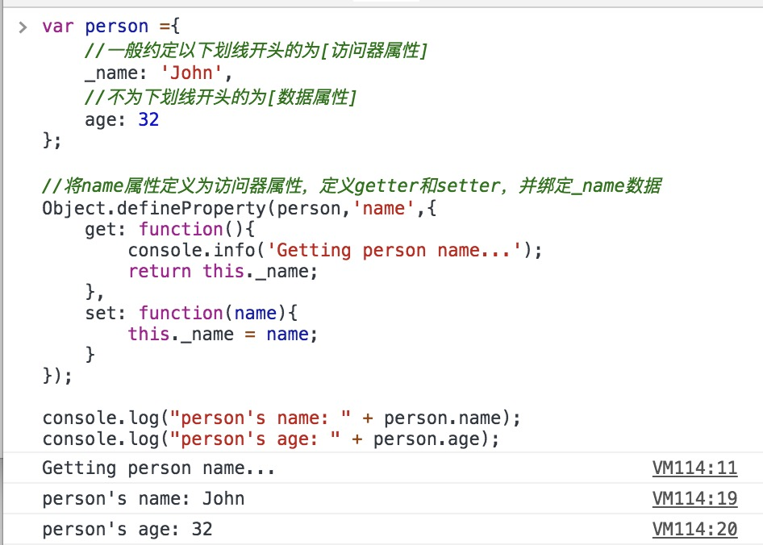
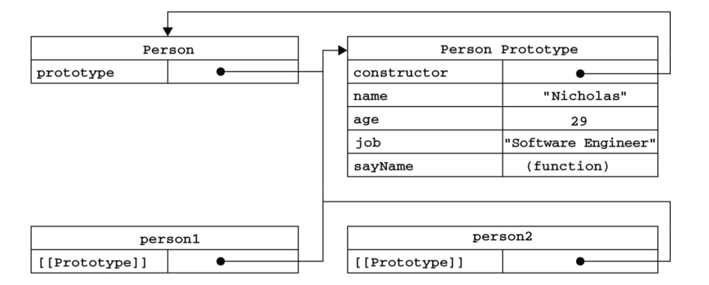
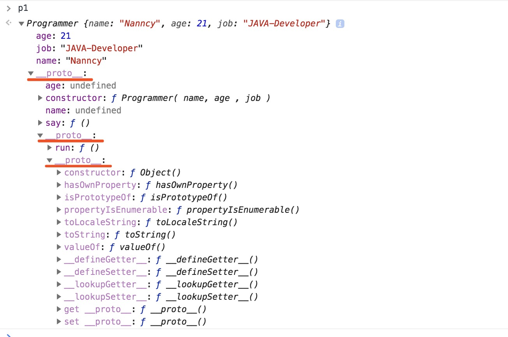

# 面对对象的程序设计

`ECMA-262`把对象定义为:“无序属性的集合，其属性可以包含基本值、对象或者函数。”严格来讲，这就相当于说对象是一组没有特定顺序的值。对象的每个属性或方法都有一个名字，而每个名字都映射 到一个值。 

> 可以将对象当做一个`java` 语言中任意数据类型的`key`为`String`类型的`Map`对象

## 理解对象

创建一个对象的最简单的方式就是创建一个`object`实例，然后为其添加属性和方法。

E.g.1

```javascript
var person = new Object();
	//添加属性
    person.name = "Nicholas";
    person.age = 29;
    person.job = "Software Engineer";
	//添加方法
    person.sayName = function(){
        alert(this.name);
};
```

关于对象的属性类型，`ECMAScript`有两种属性：**数据属性** 和 **访问器属性**。

**注意：[数据属性]和[访问器属性]定义不同，[访问器属性]的一般定义默认是以下划线`_`为开头来命名,实际上必须使用`Object.defineProperty()`来定义**。

> E.g.2
>
> ```javascript
> var person ={
>     //一般约定以下划线开头的为[访问器属性]
>     _name: 'John',
>     //不为下划线开头的为[数据属性]
>     age: 32
> };
> 
> //将name属性定义为访问器属性，定义getter和setter，并绑定_name数据
> Object.defineProperty(person,'name',{
>     get: function(){
>         console.info('Getting person name...');
>         return this._name;
>     },
>     set: function(name){
>         this._name = name;
>     }
> });
> 
> console.log("person's name: " + person.name);
> console.log("person's age: " + person.age);
> ```
>
> 执行结果：
>
> 
>
> 可以看到，访问`person.name`数据时，实际访问的是`person.name`的`get`方法

+ **数据属性**

  数据属性是包括于任何类型的数据的属性，而且可以对其赋值和修改。

  数据属性的4个特性：

  + **`Configurable` | `default true`**：表示能否通过`delete`删除属性，能否修改属性特性，能否修改为访问器属性。
  + **`Enumerable` | `default true`**：表示能否通过`for-in`来遍历返回属性
  + **`Writable` | `default true`** ：表示能否修改属性的值
  + **`Value` | `default undefined`**：实际读写存储的数据，为赋值的话，默认值为`undefined`

  **如果想要修改某个对象属性上述4个特性的默认值，则需要使用`Object.defineProperty()`方法**

  **`Object.defineProperty([obj],[property],[option])`**

  > E.g.3
  >
  > ``` javascript
  > //创建一个对象
  > var person = {
  >     name: "Alex",
  >     age: 23,
  >     email: '123456@test.com'
  > };
  > 
  > //修改name属性参数
  > Object.defineProperty(person,"name",{
  >     //禁用删除
  >     configurable: false,
  >     //属性值改为"Nero"
  >     value: "Nero",
  >     //禁用修改
  >     writable: false
  > });
  > 
  > console.log(person.name); //Nero
  > //尝试修改name属性值
  > person.name = "Gorky";
  > console.log(person.name); //Nero
  > //尝试删除name属性
  > delete person.name; //false
  > console.log(person.name); //Nero
  > ```
  >
  > 另外在严格模式下，尝试删除`configurable:false`的属性的话则会报错。
  >
  > ```javascript
  > //使用严格模式
  > "use strict";
  > delete person.name;
  > //Uncaught TypeError: Cannot delete property 'name' of #<Object>
  > ```

+ **访问器属性**

  访问器属性不包含属性值，但是有`getter`和`setter`。在访问访问器属性的时候会调用`getter`，在写入访问器属性的时候会调用`setter`

  **定义访问器的属性很简单**

  访问器属性也有4个特性：

  + **`Configurable` | `default false`**：能否使用`delete`删除该访问器属性，能否修改属性特性，能否改为数据属性特性。
  + **`Enumerable` | `default false`**：能否使用`for-in`里遍历到该属性
  + **`Get` | `default undefined`**：在读取属性所调用的函数
  + **`Set` | `default undefined`**：在写入属性所调用的函数

  **同数据属性一样，如果需要访问/修改属性特性，则调用`Object.defineProperty()`方法**

  > E.g.4
  >
  > ```javascript
  > //建立book对象
  > var book = {
  >     //以_year作为year[访问器属性]的属性值
  >     _year: 2004
  > };
  > 
  > //配置year作为[访问器属性]并设置getter，setter
  > Object.defineProperty(book,"year",{
  >     get: function(){
  >         console.log('Getting book\'s year... ');
  >         return this._year;
  >     },
  >     set: function( year ){
  >     	console.log('Setting book\'s year... ');
  >         this._year = year;
  > 	}
  > });
  > 
  > //赋值/修改操作
  > book.year = 1944;  //Setting book's year... 
  > //读取book.year的值
  > console.log("Book's year: "+book.year);
  > /*
  > Getting book's year... 
  > Book's year: 1944
  > */
  > ```
  >
  > 另外，还有旧的`getter`,`setter`方法
  >
  > ```javascript
  > //定义访问器的旧有方法
  > //getter
  > book.__defineGetter__("year", function(){
  >     console.log('Getting book\'s year... ');
  >     return this._year;
  > });
  > //setter
  > book.__defineSetter__("year", function( year ){
  >     console.log('Setting book\'s year... ');
  >     this._year = year;
  > });
  > ```

  **除了上述定义单个属性特性的用法外，也开始同时定义多个属性**

  **`Object.defineProperties([obj],[properties-option])`**

  > E.g.5:
  >
  > ```javascript
  > var book = {};
  > Object.defineProperties(book, {
  >     _year: {
  >         value: 2004
  >     },
  >     edition: {
  >         value: 1
  >     },
  >     year: {
  >         get: function(){
  >         	return this._year;
  >         },
  >         set: function(newValue){
  >             if (newValue > 2004) {
  >                 this._year = newValue;
  >                 this.edition += newValue - 2004;
  >         	}
  >     	}
  >     }
  > });
  > ```

上面用了`Object.defineProperty()`函数来定义属性特性，那么，既然也有用来读取属性特性的方法：**`Object.getOwnPropertyDescriptor() `**

> E.g.6
>
> ```javascript
> //定义属性与其属性特性
> var book = {};
> Object.defineProperties(book, {
>     _year: {
>         value: 2004
>     },
>     edition: {
>         value: 1
>     },
>     year: {
>         get: function(){
>         	return this._year;
>         },
> 	    set: function(newValue){
>         	if (newValue > 2004) {
>             	this._year = newValue;
>             	this.edition += newValue - 2004;
>             }
>         }
>     }
> });
> 
> //读取year属性特性
> var descriptor = Object.getOwnPropertyDescriptor(book,"_year");
> console.info(descriptor);
> /*
> {value: 2004, writable: false, enumerable: false, configurable: false}
> */
> descriptor = Object.getOwnPropertyDescriptor(book,"year");
> console.info(descriptor);
> /*
> {get: ƒ, set: ƒ, enumerable: false, configurable: false}
> */
> ```
>
> 上面示例结果有些和预期的有些不同
>
> **我们发现使用`Object.definePropertie()`方法定义的属性，`writable`,`enumerable`和`configurable`默认值均为`false`**

**部分细节**：

+ **访问器属性**只能通过`Object.defineProperty()/.defineProperties()`方法来定义
+ 在使用`Object.defineProperty()/.defineProperties()`定义的属性，其`writable`,`enumerable`和`configurable`默认值均为`false`


## 创建对象

### 工厂模式

专门使用一个方法来创建对象

E.g.7

```javascript
//定义创建person对象的方法
var createPerson = function( name, age ){
    var person = {
        name: name,
        age: age
    };
    return person;
};

//使用createPerson来创建对象
var person1 = createPerson('Neko',21);
console.info(person1); //{name: "Neko", age: 21}
```

工厂方式清晰明了，创建的什么对象，就是什么对象。不过没有**类**这个概念


### 构造函数模式

在`ECMAScript`中定义了`function`关键字即为函数也为**类(class)**的定义，能使用`new`和`this`关键字来构造对象

E.g.8

```javascript
//按照编程约定，构造函数名称以大写字母开头(虽然小写也可以，但是不建议)
function Person( name, age){
    this.name = name;
    this.age = age;
    this.run = function(){
        console.log(this.name += ' running...');
    }
}
function Cat( name, age ){
    this.name = name;
    this.age = age;
}

var person1 = new Person('neko',21);
person1.run(); //neko running...
console.info(person1); //Person {name: "neko running...", age: 21, run: ƒ}
console.log("person1 is Persion:",person1 instanceof Person); //person1 is Persion: true
console.log("person1 is Cat:", person1 instanceof Cat); //person1 is Cat: false
//function 关键字创建的对象默认也属于Object类型
console.log("person1 is Object:",person1 instanceof Object); //person1 is Object: true
//确认person1的构造方法
console.log(person1.constructor === Person); //true
console.log(person1.constructor === Object); //false
//普通使用{}创建的对象为obj
var obj = { number : 11};
console.log(obj.constructor === Object); //true
```

> 这写法看起来很像`JAVA`风格的构造方法。

上述案例可以发现，在`console.info()`打印生成的对象信息时候，多了`Person`字串。而且和`Date`,`Array`类型一样，创建对象使用了`new`关键字。而且也可以使用`instanceof`来确认其类型。

另外，每个对象被创建的时候，都会有`constructor`属性，就是创建该对象的**构造方法**。

对比工厂模式：

- 没有`return`
- 使用`this`来定义属性
- 没有显示的创建对象

**注意：构造函数也是函数，`new`关键字的效果就是创建了一个新的对象对应`this`关键字，如果只是当做普通函数调用，则不会创建新对象，而且获取上一级`this`关键字来创建属性**

> 但是上面定义对象中的相同方法的时候，比如上述示例中的`run`函数，每次创建对象都会给该对象创建一个新的`run`方法，为了节省内存空间，我们可以优化将其赋值为引用：
>
> ```javascript
> function Person( name, age){
>     this.name = name;
>     this.age = age;
>     //相同内容的方法，为其赋值为方法引用，让所有创建的对象调用的都是同一个方法，优化内存使用
>     this.run = personRun;
> }
> function personRun(){
>     console.log(this.name += ' running...');
> }
> ```
> 不过这样的缺点就是把`personRun`的引用给暴露在外面了，也污染了所在作用域。


### 原型模式

我们创建的`function`(函数)都有有`prototype`(原型)属性，这个属性则是一个引用/指针，指向一个对象。

`prototype`这个对象的用途就是来定义所有以该函数用`new`关键字创建的实例来定义共享的属性/方法。

E.g.9

```javascript
function Person( name, age){
    this.name = name;
    this.age = age;
}
//使用prototype定义共享的run方法
Person.prototype.run = function(){
    console.log(this.name +" running...");
}

var person = new Person("Nero",25);
person.run(); //Nero running...
//比较person对象中的run方法于Person.prototype对象中的run方法
console.log(person.run === Person.prototype.run); //true
console.info(Person.prototype); //{run: ƒ, constructor: ƒ}
```

上述例子中我们发现，`person.run`和`Person.prototype.run`完全是相同的方法，同一个引用/指针。

而且查看`Person.prototype`对象时，里面也有`constructor`函数，这也就很好理解上面[构造函数模式]中创建的对象都有`constructor`属性了。

> 在创建`function`函数中，其`prototype`属性默认含有`constructor`属性且指向其本身函数，至于其他方法，都是从Object继承来的，下图展示了各自`constructor`和`prototype`之间的关系：
>
> 
>
> `ECMAScript 5`提供了`Object.getPrototypeOf()`方法来获得对象所属的构造方法的`prototype`对象

**注意：实例对象中的属性，默认是寻找构造函数中的原型属性，若该实例重新定义了其属性，则会覆盖来自原型的引用，删除后恢复其引用**

**E.g.10**

```javascript
function Person( name, age){
    this.name = name;
    this.age = age;
}

Person.prototype.run = function(){
    console.log(this.name +" running...");
};

var person = new Person("Nero",21);
//修改person实例中的run属性的引用
person.run = function(){
    console.info(this.age + " running...");
};

person.run(); //21 running... -- 来自实例本身
//删除person实例中的run属性
delete person.run;
person.run(); //Nero running... -- 来自原型

```

**另外对于`Person.prototype = { ... }`这样的原型对象直接赋值的写法需要额外注意，因为这样是将`prototype`引用一个新的对象容易忽略`constructor`属性，如果忽略了对`constructor`属性的重新赋值，则认默来自于继承的`Object`对象，因此创建的实例也无法使用`instanceof`关键字来正确比较。**


## 继承

继承概念：继承来自父级的所有属性和方法

**使用原型继承**

在上述[创建对象]篇章中介绍了`prototype`(原型)对象，因此，我们可以使用该对象来模拟实现继承这个概念。

E.g.11

```javascript
function Person( name , age){
    this.name = name;
    this.age = age;
}
Person.prototype = {
    run : function(){
        console.log(this.name + ' running...');
    }
};

function Programmer( name, age , job  ){
    //使用apply来借用父级构造方法，实现类似java中super()方法的操作
    Person.apply(this,[name,age]);
    this.job = job;
}

//将Person的实例赋值与Programmer的原型对象，这样就获得父级的共享的属性和方法，而且不动用父级的prototype对象
Programmer.prototype = new Person();
//重新赋值其constructor
Programmer.prototype.constructor = Programmer;
//Programmer增加say方法
Programmer.prototype.say = function() {
    console.log(this.name +'('+this.job+') say : Hello World!');
};

// --- 到此为止就完成了继承步骤的操作 ---

var p1 = new Programmer("Nanncy",21,"JAVA-Developer");
p1.say(); //say : Hello World!
p1.run(); //Nanncy running...
console.log(p1 instanceof Programmer); //true
console.log(p1 instanceof Person); //true

console.log(p1.constructor === Programmer); //true
console.log(p1.constructor === Person); //false
```


## instanceof 关键字

> 该篇部分内容来自[此处](https://www.ibm.com/developerworks/cn/web/1306_jiangjj_jsinstanceof/)

在这里讲解一下`instanceof`关键字：`instanceof`主要用于判断实例所属的类型。

E.g.12

```javascript
var dt = new Date();
console.log(dt instanceof Date); //true
console.log(dt instanceof Array); //false
```

在上述继承示例中`instanceof`也能顺利判断所继承的类

ECMAScript-262 edition3 中对于instanceof的定义：

```javascript
11.8.6 The instanceof operator 
 The production RelationalExpression: 
     RelationalExpression instanceof ShiftExpression is evaluated as follows: 
 
 1. Evaluate RelationalExpression. 
 2. Call GetValue(Result(1)).// 调用 GetValue 方法得到 Result(1) 的值，设为 Result(2) 
 3. Evaluate ShiftExpression. 
 4. Call GetValue(Result(3)).// 同理，这里设为 Result(4) 
 5. If Result(4) is not an object, throw a TypeError exception.// 如果 Result(4) 不是 object，
                                                                //抛出异常
 /* 如果 Result(4) 没有 [[HasInstance]] 方法，抛出异常。规范中的所有 [[...]] 方法或者属性都是内部的，
在 JavaScript 中不能直接使用。并且规范中说明，只有 Function 对象实现了 [[HasInstance]] 方法。
所以这里可以简单的理解为：如果 Result(4) 不是 Function 对象，抛出异常 */ 
 6. If Result(4) does not have a [[HasInstance]] method, 
   throw a TypeError exception. 
 // 相当于这样调用：Result(4).[[HasInstance]](Result(2)) 
 7. Call the [[HasInstance]] method of Result(4) with parameter Result(2). 
 8. Return Result(7). 
 
 // 相关的 HasInstance 方法定义
 15.3.5.3 [[HasInstance]] (V) 
 Assume F is a Function object.// 这里 F 就是上面的 Result(4)，V 是 Result(2) 
 When the [[HasInstance]] method of F is called with value V, 
     the following steps are taken: 
 1. If V is not an object, return false.// 如果 V 不是 object，直接返回 false 
 2. Call the [[Get]] method of F with property name "prototype".// 用 [[Get]] 方法取 
                                                                // F 的 prototype 属性
 3. Let O be Result(2).//O = F.[[Get]]("prototype") 
 4. If O is not an object, throw a TypeError exception. 
 5. Let V be the value of the [[Prototype]] property of V.//V = V.[[Prototype]] 
 6. If V is null, return false. 
 // 这里是关键，如果 O 和 V 引用的是同一个对象，则返回 true；否则，到 Step 8 返回 Step 5 继续循环
 7. If O and V refer to the same object or if they refer to objects 
   joined to each other (section 13.1.2), return true. 
 8. Go to step 5.
```

上述转化成js代码则比较容易懂：

```javascript
function instance_of(L, R) {//L 表示左表达式，R 表示右表达式
 var O = R.prototype;// 取 R 的显示原型
 L = L.__proto__;// 取 L 的隐式原型
 while (true) { 
   if (L === null) 
     return false; 
   if (O === L)// 这里重点：当 O 严格等于 L 时，返回 true 
     return true; 
   L = L.__proto__; 
 } 
}
```

也就是，对象中有个对构造函数(类)的 `prototype` 的隐式引用，在chrome内核中该隐式实现为 `__proto__` 对象。`instanceof` 则就是判断该对象的 **`__proto__` 链**是否含有对比**构造函数**的 `__proto__` 。

在***E.g.11***示例中`p1`对象解析结果如下：



可以看到p1的原型指针链

 ```txt
p1.__proto__ -> [Programmer.prototype].__proto__ -> [Person.prototype].__proto__ -> Object.prototype
 ```

p1的`__proto__` 一直从`Programmer`->`Person`->`Object`;

因此`instanceof`关键字比较结果均为true

```javascript
p1 instanceof Programmer; //true
p1 instanceof Person; //true
p1 instanceof Object; //true
```

