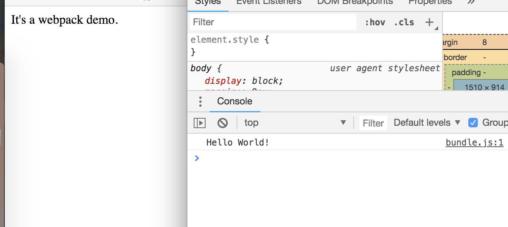
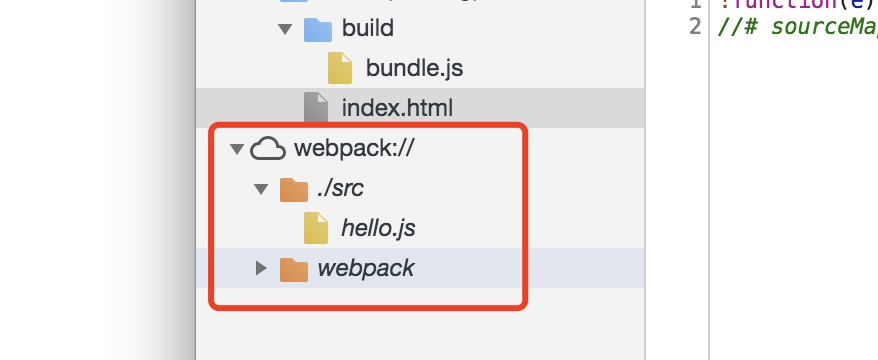
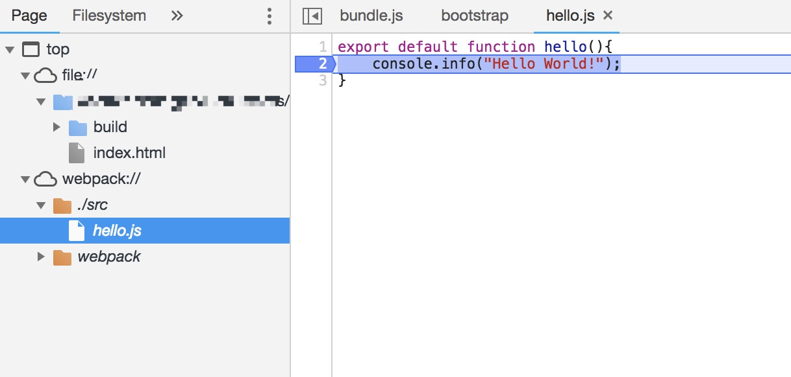

# webpack初试

## 构建一个demo项目

首先我们先构建一个npm项目

```shell
$mkdir webpack-demo

$cd webpack-demo

$npm init -y
Wrote to ~/demo-webpack/package.json:
{
  "name": "demo-webpack",
  "version": "1.0.0",
  "description": "",
  "main": "index.js",
  "scripts": {
    "test": "echo \"Error: no test specified\" && exit 1"
  },
  "keywords": [],
  "author": "",
  "license": "ISC"
}

```


## 安装 webpack

```shell
$npm install webpack webpack-cli --save-dev 
#从webpack v4版本开始，就需要安装webpack-cli或者webpack-command
```

安装过程可能比较慢，换一个国内的npm镜像就会好很多


## 配置 package.json

**package.json**

```diff
  {
    "name": "demo-webpack",
    "version": "1.0.0",
    "description": "",
+   "private": true,
-  	"main": "index.js",
    "scripts": {
      "test": "echo \"Error: no test specified\" && exit 1",
+     "build": "webpack --config webpack.config.js"
    },
    "keywords": [],
    "author": "",
    "license": "ISC",
    "devDependencies": {
      "clean-webpack-plugin": "^0.1.19",
      "css-loader": "^0.28.11",
      "file-loader": "^1.1.11",
      "style-loader": "^0.21.0",
      "webpack": "^4.12.1",
      "webpack-cli": "^3.0.8",
      "webpack-dev-server": "^3.1.4"
    }
  }

```

去掉`main`是因为这个其实并不是node项目，没有主执行文件。

增加`private`是因为防止项目被发布到npmjs上去，这只是一个用于webpack打包的，并不是可用于发布的单模块项目。

此时若执行`npm run build`则会执行`webpack --config webpack.config.js`命令其中`webpack.config.js`就是配置webpack配置文件


## 配置 webpack.config.js

```shell
#创建weibpack.config.js
$npm touch webpack.config.js
```

**webpack.config.js**

```javascript
module.exports = {
	entry: './index.js',
    output: {
    	path: __dirname + '/build',
    	filename: 'bundle.js'
	}
};
```

先暂时解释上述一部分配置：

`entry`: webpack 打包入口文件

`output`: webpack输出配置，其中`path`是输出路径，`filename`是打包后输出的文件


## 编写demo测试内容

**src/hello.js**

```javascript
export default function hello(){
	console.info("Hello World!");
}
```

**index.js**

```javascript
import hello from './src/hello.js';

hello();
```

此时文件目录结构是这样的

```
./demo-webpack
├── index.html
├── index.js
├── node_modules
│   └── .... 
├── package-lock.json
├── package.json
├── src
│   └── hello.js
└── webpack.config.js
```


## 打包测试

输入指令`npm run build`(之前在`package.json`中配置的`scripts.build`属性)

```shell
$npm run build

> demo-webpack@1.0.0 build ~/demo-webpack
> webpack --config webpack.config.js

Hash: c9535e0233c0d898ad81
Version: webpack 4.12.1
Time: 94ms
Built at: 06/25/2018 8:44:13 PM
    Asset       Size  Chunks             Chunk Names
bundle.js  980 bytes       0  [emitted]  main
[0] ./index.js + 1 modules 110 bytes {0} [built]
    | ./index.js 45 bytes [built]
    | ./src/hello.js 65 bytes [built]

WARNING in configuration
The 'mode' option has not been set, webpack will fallback to 'production' for this value. Set 'mode' option to 'development' or 'production' to enable defaults for each environment.
You can also set it to 'none' to disable any default behavior. Learn more: https://webpack.js.org/concepts/mode/
```

此时会生成`./build/bundle.js`文件，而且在Index.html中引入

**index.html**

```html
<!DOCTYPE>
<html>
	<head>
		<title>Webpack-demo</title>
	</head>
	<body>It's a webpack demo.</body>
	<script type="text/javascript" src = "build/bundle.js"></script>
</html>
```

用浏览器打开`index.html`测试



成功则如上图。


## 使用source-map进行debug

**注意：该段内容请勿用在正式环境上！**

但是这有一个问题，打包之后的代码根本不适合浏览器调试，没事，webpack 还有一个功能。

配置`webpack.confg.js` 添加`devtool`选项：

```javascript
module.exports = {
    //添加devtool工具
	devtool: 'source-map',
	entry: './index.js',
    output: {
    	path: __dirname + '/build',
    	filename: 'bundle.js'
	}
};
```

然后再次执行`npm run build`打包，此时`webpack`会对源码做一次映射，然后在生成的`./build`文件夹中

多一个`bundle.js.map`内容，这个就是源码映射文件了

再一次用浏览器打开`index.html`



此时在**source**标签的源码目录下多了一个`webpack://`路径,这里就是存放的打包的源码



一样是可以用浏览器开发者模式同时进行断点debug的。

