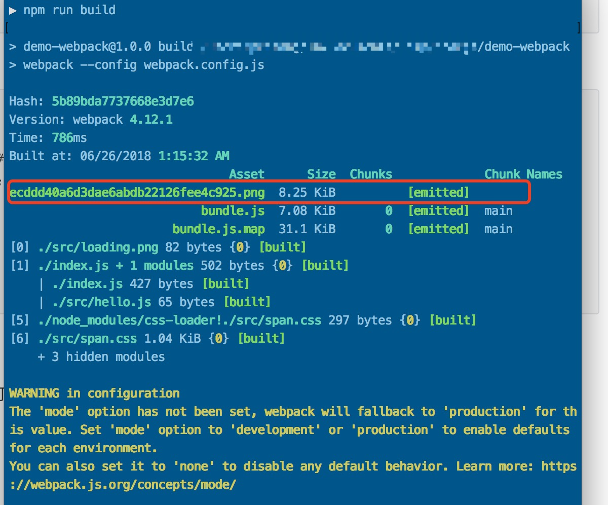
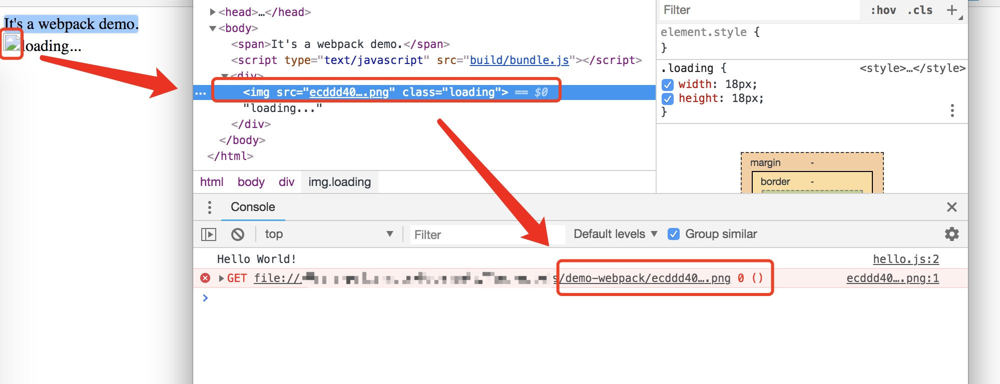
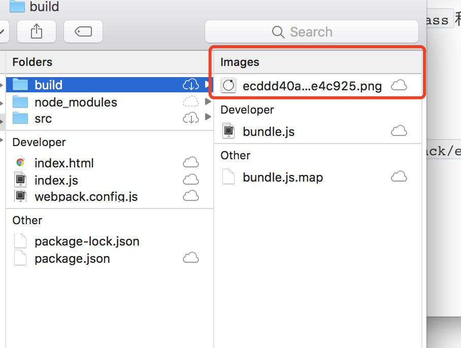
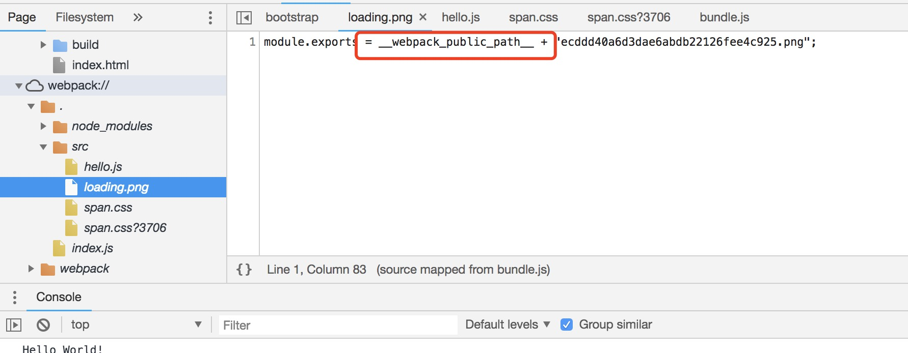

# 资源管理

前端在开发的时候需要管理很多的资源文件，比如图片，CSS等....

Webpack 除了在打包js的时候，也有能对于其他资源文件统一打包更是必要的功能

webpack几乎能打包任何形式的文件，当然也必须要有其对应的`loader`模块才能正常工作。

以下例子主要是将图像，CSS进行打包的安利。

承接上一篇[webpack初试](./2-webpack初试.md)的内容，继续使用`demo-webpack`作为案例项目


## 加载CSS

若要让webpack加载你的css，一起打包。则需要`style-loader`和`css-loader`

### 安装loader

```shell
$npm install --save-dev style-loader css-loader
```

### 配置rules

在`webpack.config.js`中修改如下:

```diff
  module.exports = {
  	devtool: 'source-map',
  	entry: './index.js',
  	output: {
  	path: __dirname + '/build',
  	filename: 'bundle.js'
  	},
+ 	module: {
+ 		rules: [
+ 			{ test: /\.css$/ , use: [ 'style-loader', 'css-loader'] }
+ 		]
+ 	}
  };
```

其中`module.rules`为匹配规则数组

+ `test` 为匹配的文件的正则表达式
+ `use` 为上述匹配的文件所采取的`loader`

这里css文件采用了`style-loader`和`css-loader`**。**

**需要注意的是，`style-loader`和`css-loader`不能搞错顺序，webpack会顺序使用`loader`加载**

### 编写demo测试内容

**src/span.css**

```css
span {
	background-color : #99ccff;
	border: 1px solid #eee;
	border-radius: 4px;
}
```

**index.js**

```diff
  import hello from './src/hello.js';

+ //导入css样式文件
+ import './src/span.css';

  hello();
```

**index.html**

```diff
  <!DOCTYPE>
  <html>
  	<head>
  		<title>Webpack-demo</title>
  	</head>
  	<body>
- 		It's a webpack demo.
+ 		<!-- 增加span标签用于测试 -->
+ 		<span>It's a webpack demo.</span>
  	</body>
  <script type="text/javascript" src = "build/bundle.js"></script>
  </html>
```


### 打包测试

执行`npm run build`测试


如上图所示打开`index.html`能发现`span.css`样式能被正常引入则表示成功。


## 加载图片

在上面的打包CSS的基础上，我们还要打包图片

### 安装loader

加载文件我们需要使用`file-loader`

```shell
$npm install --save-dev file-loader
```

### 配置rules

**webpack.config.js**

```diff
  module.exports = {
  	devtool: 'source-map',
  	entry: './index.js',
      output: {
      	path: __dirname + '/build',
      	filename: 'bundle.js'
  	},
  	module: {
  		rules: [
  			{ test: /\.css$/, use: [ 'style-loader', 'css-loader'] },
+ 			//添加对图片文件处理的加载规则
+ 			{ test: /\.(jpg|gif|png|svg)$/, use: ['file-loader'] }
  		]
  	}
  };
```

### 编写demo测试内容

我们加入一张loading(src/loading.png)图片作为测试:


**index.js**

```diff
  import hello from './src/hello.js';
  //导入css样式文件
  import './src/span.css';
+ //导入loading图片
+ import loadingIcon from './src/loading.png'

  hello();

+ (()=>{
+ 	let loadingDiv = document.createElement('div');
+ 	let loadingImage = new Image();
+ 	loadingImage.src = loadingIcon;
+ 	loadingDiv.appendChild(loadingImage);
+ 	loadingImage.classList.add('loading');
+ 	loadingDiv.innerHTML += 'loading...';
+ 	document.body.appendChild(loadingDiv);
+ })();
```

**span.css**

```diff
  span {
  	background-color : #99ccff;
  	border: 1px solid #eee;
  	border-radius: 4px;
  }
+ .loading {
+ 	width: 18px;
+ 	height: 18px;
+ }
```

### 打包测试

使用`npm run build`指令来打包，此时`webpack`在使用`file-loader`加载图片的时候会复制一份到`path`目录下，名以`hash`值进行重命名



打包完毕后打开`index.html`查看测试结果



我们看到`loadingDIV`成功被渲染，并且附上了`class`和`src`属性

可是图片虽然打包陈宫了却加载失败。

### 故障排除

上述图片中可以看出，图片引用路径为`demo-webpack/ecddd40a6d3dae6abdb22126fee4c925.png`

可实际上图片被打包到`./build`路径内



因此`index.html`中正确的引用路径应该为``demo-webpack/build/ecddd40a6d3dae6abdb22126fee4c925.png``

中间少了一个`build`路径。

我们再切到浏览器开发者环境`Sources`选项卡，查看`webpack://`下的`-/src/loading.png`的实际内容：



上图发现该图片前缀是`__webpack_public_path__`路径。

实际上webpack打包文件（除了js文件）后，webpack会构建一个虚拟路径用于资源的访问即`__webpack_public_path__`,不过该配置默认值为空才导致直接在`index.html`同级路径下查找资源文件。

**解决方案**

> 修改`webpack.config.js`文件，配置`output.publicPath`属性
>
> **webpack.config.js**
>
> ```diff
>   module.exports = {
>   	devtool: 'source-map',
>   	entry: './index.js',
>       output: {
>       	path: __dirname + '/build',
> +     	publicPath: 'build/',
>       	filename: 'bundle.js'
>   	},
>   	module: {
>   		rules: [
>   			{ test: /\.css$/, use: [ 'style-loader', 'css-loader'] },
>   			//添加对图片文件处理的加载规则
>   			{ test: /\.(jpg|gif|png|svg)$/, use: ['file-loader'] }
>   		]
>   	}
>   };
> ```
>
> 再次执行`npm run build`并查看执行结果
>
> 
>
> 查看执行正常，图片引入地址正确的加入了`build/`路径


其他部分加载可以查阅官方文档，字体啊，文件啊之类的。

[Asset Management](https://webpack.js.org/guides/asset-management/)

