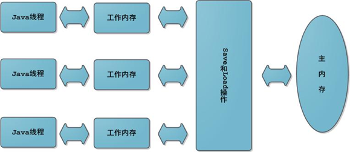
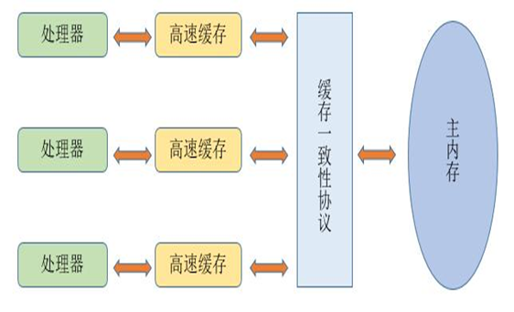

# JMM内存模型

## 并发编程特征

 Java内存模型是围绕着并发编程中「原子性」、「可见性」、「有序性」这三个特征来建立的

+ **原子性**

  原子性就是对于变量来说，一个操作不能被打断，类似事务处理，一次操作要么全部执行完成，如果执行中断，则所有操作视为无效(即回滚)

  > 基本数据的访问都是原子性操作，但是 `long` , `double` 这类64位的数据由于32位的运行环境会导致原子性被破坏（即线程不安全，得加上 `synchronized` 关键字）。

+ **可见性**

  一个变量的值在被改变的时候，所有涉及该变量的线程都能随时"感知"到这个变量的变化

+ **有序性**

  不管是多线程还是单线程，在同一个线程中，代码执行得是有序的

  

## 图像模型

JMM模式和CPU的处理模式很像

但是这个内存模型，实际上有可能会破坏**可见性**

比如在 [线程1] 读取 [线程2] 的 [属性a] 时候，[属性a] 还没从 [线程2] 上更新到 [主内存中]，导致 [线程1] 无法立即感知到 [属性a] 被立即刷新了。

**在`JVM`中，对`JMM`的每个线程的自己独立的【工作内存】实际上只是一个【抽象化】的概念，实际上所有变量都会存在【主内存】中，对于线程自己私有的【工作内存/本地内存】实际上储存的是用于读/写的共享变量的【副本】**

这个时候还是需要 `synchronized` 或者 `volatile` 关键字

> 这是CPU的内存处理机制
>
> 

## Heap

`Heap` 是堆内存，就是**存储了所有的 `JAVA` 对象**

## Thread Stack

`Thread Stack` 是栈内存，就是**存储了所属线程的 `Method` 执行过程**

---

在JVM里面，会把它管理的内存根据用途分成不同的区域：

