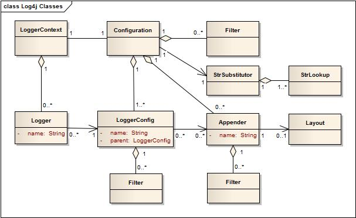

# Log4j的构架

该笔记内容主要为[官方文档](http://logging.apache.org/log4j/2.x/manual/architecture.html)的翻译，以及方便自己理解稍作改动的内容，Log4j 有1.x 版本和 2.x 版本，该笔记内容基本以log4j 2.x为准


##主要组件

先上图：



应用若要使用Log4j的API，则使用一个具体的名字来请求LogManager。LogManager则会选取合适的LoggerContext后生成Logger并返回给应用。若该Logger必须被创建，则它关联的LoggerContext可能会包含以下属性:a) 同名的Logger 	b) 父级包名	c) root LoggerConfig


## 层次结构

首先最重要的一点就是，任何日志API 都优于`System.out.println`的优势就是能阻止某些的信息打印，同时又能让其他信息进行正常打印。这个功能被称为日志空间，该空间用来管理所有可能需要打印的日志，并且针对分类规则可用于开发人员进行选择性的打印。

在Log4j 的1.x 版本中，Logger Hierachy 用于记录维护Loggers之间的联系。在Log4j 的 2.x 版本中，该关联关系已经不存在了，Hierachy 被用于记录维护LoggerConfig对象之间的联系

Logger和LoggerConfig都是有名称的实体。Logger的名称是区分大小写的，它遵循以下分层规则：

> 如果该LoggerConfig(A)的名称是另一个LoggerConfig(B)的以`.`结束的前缀，则该LoggerCongfig(A)是LoggerConfig(B)的祖先。若LoggerConfig(A) 与LoggerConfig(B) 中间没有其他LoggerConfig层，则LoggerConfig(A)为LoggerConfig(B) 的父级
>
> 例如：`com.foo`是`com.foo.bar`的父级是`com.foo.bar.head`的祖先

**Root LoggerConfig是特殊情况，它是所有LoggerConfig的祖先（和JAVA中的Object类似）。**

```java
//可以用LogManager.ROOT_LOGGER_NAME获得
Logger rootLogger = LogManager.getLogger(LogManager.ROOT_LOGGER_NAME);
//或者更简单，直接getRootLogger()
Logger rootLogger = LogManager.getRootLogger();
```

> 由于`LogManager.ROOT_LOGGER_NAME = "";`，即`rootLogger.getName();`返回的就是`""`（空字串）。

任何Logger都可以通过name来获取。


## LoggerContext

LoggerContext为日志系统中的锚点，当然，在更多复杂的应用场景下，可能会有多个活动的LoggerContext对象。

//TODO 留给更多细节补充说明


##Configuration

每个LoggerContext都有一个活动的Configuration,该Configuration包含了所有的Appender， context-wide Filters，LoggerConfigs和对StrSubstitutor的引用。若存在两个Configuration,若其中某个Configuration包含了所有Loggers，则另一个Configuration立即被销毁回收。

Configuration通常是在程序初始化时候时候硬完成生成，首选的方法就是读取配置文件进行生成。


## Logger

之前说明了没有Loggers之间的关联，只有LoggerConfig的关联。Logger则类似是LoggerConfig的引用，Logger只有一个名称和对继承AbstractLogger类而所需要实现的方法，Logger没有任何行为，基本都是访问其内部类PrivateConfig的操作，而PrivateConfig则访问的是Configuration和关联的LoggerConfig。若Configuration被修改了Logger后可能会导致其关联的LoggerConfig也不同，所以导致该Logger的行为结果可能会不一样。

> log4j2 中的 Logger的部分源码
>
> ```java
>
> public PrivateConfig(final Configuration config, final Logger logger) {
>             this.config = config;
>             this.loggerConfig = config.getLoggerConfig(getName());
>             this.loggerConfigLevel = this.loggerConfig.getLevel();
>             this.intLevel = this.loggerConfigLevel.intLevel();
>             this.logger = logger;
> }
>
> protected void updateConfiguration(final Configuration newConfig) {
>     this.privateConfig = new PrivateConfig(newConfig, this);
> }
>
> ```
>
> 可以看到，当该Logger的Configuration被修改时候，PrivateConfig被重新构造了一个出来，从新的Configuration中获取新的LoggerConfig。

**获得Logger**

只需要调用`LogManager.getLogger`方法即可获得logger，相同名称的Logger是同一个对象。

E.g.

```java
Logger x = LogManager.getLogger("wombat");
Logger y = LogManager.getLogger("wombat");
//x和y指的是同一个logger
```

Log4j由于使用了上述分层命名方案，因此可以很容易的在Java中命名唯一限定名称：该类完整包路径。

E.g. 

```java
Logger barLogger1 = LogManager.getLogger("com.foo.Bar");
Logger barLogger2 = LogManager.getLogger(Bar.class.getName());
Logger barLogger3 = LogManager.getLogger(Bar.class);
//当Bar.class的路径为com.foo.Bar时候，此处barLogger1，barLogger2，barLogger3均指代同样的Logger对象
```

因为Log4j打印日志的时候会展示Logger的名称，因此在查看日志的时候可以很快锁定日志发生位置。

因基本上在给Logger给予限定名的时候都是用该类的全路径来表示，因此Log4j提供了`LogManager.getLogger();`这个省略了参数的方法直接就能快速的获得一个由该类的全名做为名称的Logger对象。


## LoggerConfig

当Configuration声明Logger的时候，同时创建LoggerConfig对象。LoggerConfig对象包含了一组Filter过滤器，当LogEvent对象要传递给Appender的时候，必须经过这些过滤器。并且LoggerConfig也包含了需要处理LogEvent对象的Appender的引用对象。

**Log Levels**

LoggerConfig对象将会被分配一个Log Level。Log4j的内置级别有：TRACE, DEBUG, INFO, WARN, ERROR, 和 FATAL。另外一种获取更细的粒度的日志是使用Markers。

> Log4j2 支持自定义Log Level

Log4j 1.x 和logback 都拥"等级继承(Level Inheritance)"的概念。在log4j 2.x 中，由于Logger和LoggerConfig是两种不同的对象。所以这个概念实现是非常不同的。每个logger都有相应的LoggerConfig，而LoggerConfig有父级，因此Log4j 2.x中的等级继承其实是来自于loggerConfig父级的等级继承。

下面几张表来简单说明了各个日志等级与关联的每一个Logger的结果等级。**需要注意的是，在以下所有表中的情况，若未配置Root LoggerConfig，则会为其分配默认级别(ERROR)。**

示例1：若只有Root Logger 被配置了LoggerConfig并被分配了日志级别，则所有Logger都引用Root LoggerConfig的日志级别。

| Logger 名称 | 分配的 LoggerConfig | LoggerConfig Level | Level |
| ----------- | ------------------- | ------------------ | ----- |
| root        | root                | DEBUG              | DEBUG |
| X           | root                | DEBUG              | DEBUG |
| X.Y         | root                | DEBUG              | DEBUG |
| X.Y.Z       | root                | DEBUG              | DEBUG |

示例2：若所有logger都有其分配的的有级别的LoggerConfig，则使用LoggerConfig中的日志等级。

| Logger 名称 | 分配的 LoggerConfig | LoggerConfig Level | Level |
| :---------- | :------------------ | :----------------- | :---- |
| root        | root                | DEBUG              | DEBUG |
| X           | X                   | ERROR              | ERROR |
| X.Y         | X.Y                 | INFO               | INFO  |
| X.Y.Z       | X.Y.Z               | WARN               | WARN  |

示例3: logger(X)和logger(X.Y.Z)都有其相同名称有级别的LoggerConfig。则logger(X)和logger(Y)都是使用其LoggerConfig的日志等级，logger(X.Y)并没有其LoggerConfig，则使用其父级的logger(X)的loggerConfig的日志等级。

| Logger 名称 | 分配的 LoggerConfig | LoggerConfig Level | Level |
| ----------- | ------------------- | ------------------ | ----- |
| root        | root                | DEBUG              | DEBUG |
| X           | X                   | ERROR              | ERROR |
| X.Y         | X                   | ERROR              | ERROR |
| X.Y.Z       | X.Y.Z               | WARN               | WARN  |

示例4：logger(X)和logger(root) 都有其分配有级别的LoggerConfig，则它们的日志等级均为对应的LoggerConfig日志等级。而logger(X.Y)和logger(X.Y.Z)并没有其分配的LoggerConfig，则它们使用父级的LoggerConfig。

| Logger 名称 | 分配的 LoggerConfig | LoggerConfig Level | level |
| ----------- | ------------------- | ------------------ | ----- |
| root        | root                | DEBUG              | DEBUG |
| X           | X                   | ERROR              | ERROR |
| X.Y         | X                   | ERROR              | ERROR |
| X.Y.Z       | X                   | ERROR              | ERROR |

示例5：同示例4效果一样，注意X.YZ的父级不是X.Y而是X

| Logger 名称 | 分配的 LoggerConfig | LoggerConfig Level | level |
| ----------- | ------------------- | ------------------ | ----- |
| root        | root                | DEBUG              | DEBUG |
| X           | X                   | ERROR              | ERROR |
| X.Y         | X.Y                 | INFO               | INFO  |
| X.YZ        | X                   | ERROR              | ERROR |

示例6：logger(X)和logger(root) 有其分配有日志级别的LoggerConfig，而logger(X.Y)和logger(X.Y.Z) 虽然有其分配的LoggerConfig，但都无级别。则它们的级别均继承自logger(X)

| Logger 名称 | 分配的 LoggerConfig | LoggerConfig Level | Level |
| ----------- | ------------------- | ------------------ | ----- |
| root        | root                | DEBUG              | DEBUG |
| X           | X                   | ERROR              | ERROR |
| X.Y         | X.Y                 |                    | ERROR |
| X.Y.Z       | X.Y                 |                    | ERROR |

下表展示了关于LoggerConfig的日志级别和LogEvent的日志级别的所对应的日志是否正常处理。

| Event Level | LoggerConfig Level |           |          |          |           |           |         |
| ----------- | ------------------ | --------- | -------- | -------- | --------- | --------- | ------- |
|             | **TRACE**          | **DEBUG** | **INFO** | **WARN** | **ERROR** | **FATAL** | **OFF** |
| **ALL**     | YES                | YES       | YES      | YES      | YES       | YES       | NO      |
| **TRACE**   | YES                | NO        | NO       | NO       | NO        | NO        | NO      |
| **DEBUG**   | YES                | YES       | NO       | NO       | NO        | NO        | NO      |
| **INFO**    | YES                | YES       | YES      | NO       | NO        | NO        | NO      |
| **WARN**    | YES                | YES       | YES      | YES      | NO        | NO        | NO      |
| **ERROR**   | YES                | YES       | YES      | YES      | YES       | NO        | NO      |
| **FATAL**   | YES                | YES       | YES      | YES      | YES       | YES       | NO      |
| **OFF**     | NO                 | NO        | NO       | NO       | NO        | NO        | NO      |

> 左侧列的Even Level指的是LogEvent 比如:
>
> ```java
> Logger logger = LogManager.getLogger("test");
> logger.info("This is test string."); //这是logEvent,输出“This is test string.”是等级为info的logEvent
> ```
>
> 而横向的LoggerConfig level指的是类似如下配置文件中的Logger
>
> ```xml
> <logger name="test" level = "DEBUG">...</logger>
> ```
>
> 那么，我有一个疑问？Java代码中的logger 和配置文件中的logger是不是同一个呢？
>
> 我的猜想是应该是同一个。在程序启动的时候。log4j优先读取配置文件，先根据配置文件创建好相应的logger，然后Java代码中从`LogManager.getLogger`方法获取的就是通过配置文件创建好的Logger，若配置文件中没有预先配置的logger，则会创建一个新的Logger并使用其父级的LoggerConfig。


## Filter

除了上述的通过Logger level来过滤日志外，Log4j 还提供了过滤器。在判断日志等级之前执行过滤操作。过滤器有三个返回值：ACCEPT，NEUTRAL，DENY。当其中一个过滤器返回了ACCEPT后，直接进行日志处理跳过日志等级过滤。当过滤器返回为NEUTRAL时候，则移交给下一个过滤器处理，若所有过滤器均为NEUTRAL，则继续判断日志等级，当其中一个过滤器返回为DENY时，直接拒绝处理该日志操作。

以下为该主要Filter执行判断的源码

```java
boolean filter(final Level level, final Marker marker, final String msg, final Throwable t) {
    final Filter filter = config.getFilter();
    if (filter != null) {
		//此步骤就处理了所有过滤器，而非单只是一个过滤器(虽然返回的也是Result枚举)
        final Filter.Result r = filter.filter(logger, level, marker, (Object) msg, t);
        if (r != Filter.Result.NEUTRAL) {
            return r == Filter.Result.ACCEPT;
        }
    }
    return level != null && intLevel >= level.intLevel();
}
```

上述当中的`final Filter.Result r = filter.filter(logger, level, marker, (Object) msg, t);`语句则跳转入下面方法

```java
public Result filter(final Logger logger, final Level level, final Marker marker, final String msg,
        final Object p0, final Object p1, final Object p2) {
    Result result = Result.NEUTRAL;
    for (int i = 0; i < filters.length; i++) {
        result = filters[i].filter(logger, level, marker, msg, p0, p1, p2);
        if (result == Result.ACCEPT || result == Result.DENY) {
            return result;
        }
    }
    return result;
}
```

> 有一点很重要，那就是只要有过滤器返回了ACCEPT或者DENY，则就跳过日志等级判断。
>
> 当只有所有过滤器都是返回了NEUTRAL才会继续执行日志等级判断


## Appender

Log4j 支持将日志输出到多个目的地，在log4j中 将日志输出到目的地的应用叫做Appender。目前内置的Appender有Console,Files,远程socket服务，Apache Flume,JMS以及远程Unix的系统守护日志，还有各类数据库的API。一个Logger可以拥有多个Appender。若以上内置的还无法满足的话，也可以定制化appender。

Logger若要添加一个Appender，可以使用当前的Configuration的`addLoggerAppender`方法。若该Logger没有对应名称的LoggerConfig，则会自动创建一个LoggerConfig并添加该Appender。然后更新所有的Logger更新LoggerConfig（主要是重构父子级关系已经重新分配LoggerConfig）。

> **logger输出日志的时候，将会给定所有LoggerConfig关联的Appender和所有从父级/祖先LoggerConfig继承下的Appender**

**Appender Additivity**

换句话说，由于Appender也是根据LoggerConfig的继承关系间接继承的。上述已经说明了父级LoggerConfig中的Appender一样会被触发，那么就会出现的许多日志被重复输出。比如loggerConfig(root)有一个Console的Appender，LoggerConfig(X)有另一个FileAppender。那么Logger(X)在输出日志的时候也会在Root的Console Appender中重复输出一遍，会造成日志冗余。这时候log4j为了避免这类日志冗余问题，可以在配置文件中使用`additivity = "false"`来避免（默认为true）。也可是使用Configuration的`setLoggerAdditive`方法来修改


## Layout

如果说Appender是输出的目的地，那么Layout就是输出格式。更多的时候，为了我们方便的阅读日志，我们需要自定输出日志的格式。

**PatternLayout**是标准发行版log4j中的一部分。它遵循了C语言中的`printf`方法的规则。

比如parrterLayout中的格式为：`%r [%t] %-5p %c - %m%n`

则该Layout输出的内容例子为：`176 [main] INFO  org.foo.Bar - Located nearest gas station.`

> 第一个字段是程序启动后经过的毫秒数，第二个字段是日志请求的线程，第三个字段是日志语句级别，第四个字段是与日志请求关联的日志名称， '-' 后面是日志信息。

一个Layout可以附属于多个Appender，但是一个Appender只有一个Layout。


## StrSubstitutor and StrLookup

//TODO 由于暂时不了解[Apache Commons Lang](https://commons.apache.org/proper/commons-lang/)的机制则。那么我无法