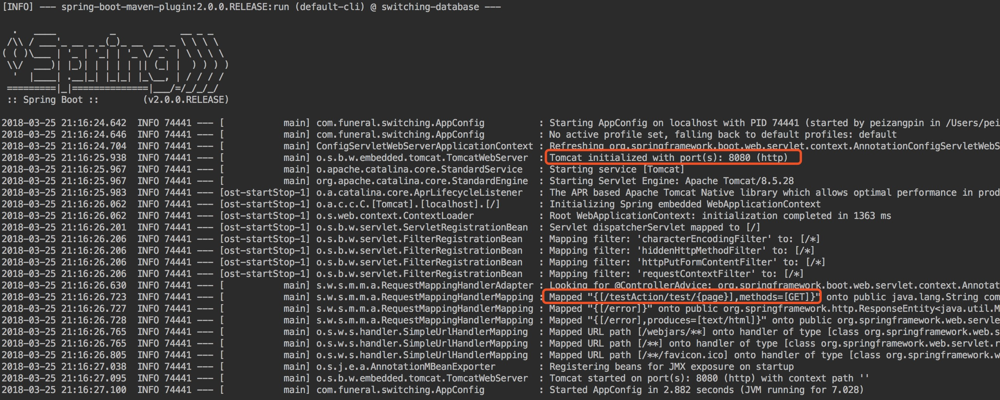
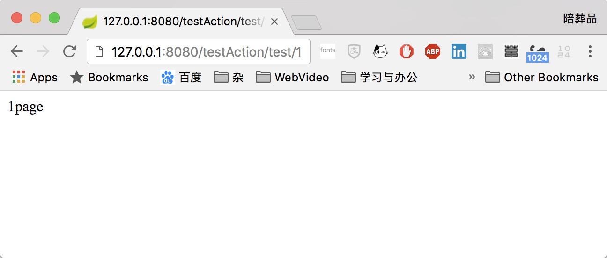
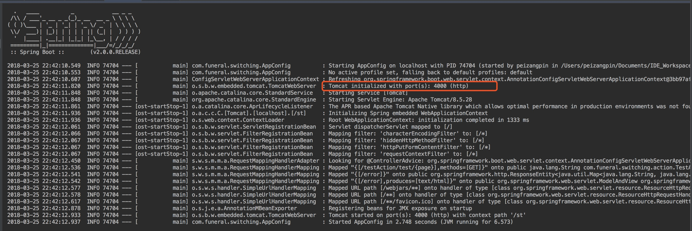
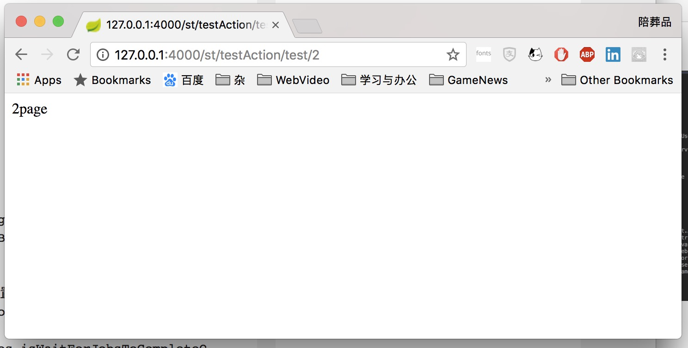

# 快速上手Spring Boot

对spring-boot各类设定说明前，先来快速上手一个mvc工程，暂时先不解释部分知识

##web-mvc项目

首先来看目录结构

```bash
.
├── pom.xml
├── src
│   ├── main
│   │   ├── java
│   │   │   └── com
│   │   │       └── funeral
│   │   │           └── test
│   │   │               ├── AppConfig.java
│   │   │               └── action
│   │   │                   └── TestAction.java
│   │   └── resources
│   └── test
│       └── java
└── pom.xml
```

### pom.xml

> spring-boot的pom文件内容暂不做解释，后续详解

Spring boot的pom的所需配置

```Xml
...
<!-- 继承spring-boot指定父级 -->
<parent>
    <groupId>org.springframework.boot</groupId>
    <artifactId>spring-boot-starter-parent</artifactId>
    <version>2.0.0.RELEASE</version>
</parent>
<dependencies>
    <!-- 添加spring-boot的web依赖 -->
    <dependency>
        <groupId>org.springframework.boot</groupId>
        <artifactId>spring-boot-starter-web</artifactId>
    </dependency>
</dependencies>

...
```

### controller

Controller层的TestAction:

```java
//编写一个简易的controller
@RestController
@RequestMapping("/testAction")
public class TestAction {

    @RequestMapping(value = "/test/{page}",method = RequestMethod.GET)
    public String show(@PathVariable("page") Integer page){
        if(page == null){
            return "Not Page";
        }
        return page+"page";
    }
}
```


### main-class

> main-class 目前暂不做解释，后续详解

Spring-boot运行的是需要一个入口，即main-class

AppConfig:

```java
@SpringBootApplication
public class AppConfig {
    public static void main(String[] args) {
        SpringApplication.run(AppConfig.class);
    }
}
```


###启动spring-boot项目

> 启动指令目前暂不做解释，后续详解

好了，现在我们只编写了3个文件，一个项目配置pom.xml，一个main-class，一个contorller。

引用官方的话就是`just run`。

执行如下指令可以直接运行了

```bash
mvn spring-boot:run
```



(无视switching包…这是我写笔记测试用的)

上图是执行结果，可以看到，Spring-boot默认使用tomcat作为容器启动服务了端口是8080，并且也成功生成了`/testAction/test/{page}`路径的servlet

> 此时servlet默认直接将`/`(根目录)作为context上下文

执行试试：`http://127.0.0.1:8080/testAction/test/1`



如图：测试成功。

针对上面案例可以得知，spring-boot自动帮你省略了一般web程序的配置文件：`web.xml`,`application-context.xml`,`spring-mvc.xml`。并且自动配置好了tomcat部署插件，现在只需一个入口(main-class)运行即可。

这就是spring-boot它实际展现的效果。

那么，现在我们来修改部分配置。在spring-boot中虽然它为我们自动约定了几乎所有的配置，但是实际场景肯定不会让spring-boot默认一切的。

这时候spring-boot提供了`application.properties`配置文件来改变某些配置。


### application.properties

在`/resources`路径下新建`application.properties`文件

> Spring-boot 默认加载/resources/appliction.properties文件

application.properties

```properties
#修改默认8080端口
server.port=4000
#修改默认servlet的context上下文路径为/st
server.servlet.context-path=/st
```

此时在运行看看效果：



此时控制台已经有日志显示为4000端口了



实际页面也访问成功。


## 总结

+ 使用spring-boot 需要以spring-boot的pom依赖配置

  ```xml
  <!-- 继承spring-boot指定父级 -->
  <parent>
      <groupId>org.springframework.boot</groupId>
      <artifactId>spring-boot-starter-parent</artifactId>
      <version>2.0.0.RELEASE</version>
  </parent>
  <dependencies>
      <!-- 添加spring-boot的web依赖 -->
      <dependency>
          <groupId>org.springframework.boot</groupId>
          <artifactId>spring-boot-starter-web</artifactId>
      </dependency>
  </dependencies>
  ```

+ 认识启动spring-boot 指令：`mvn spring-boot:run`


+ 修改spring-boot的默认配置在`/resources/application.properties`文件中

