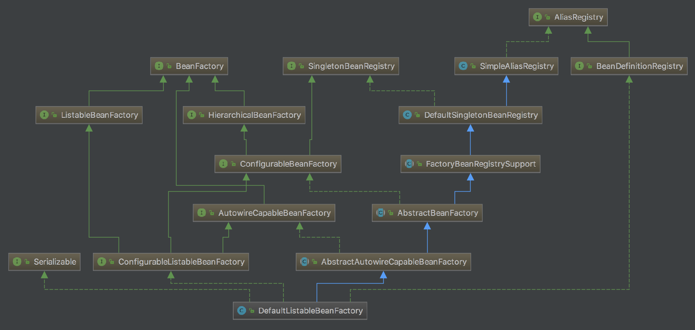
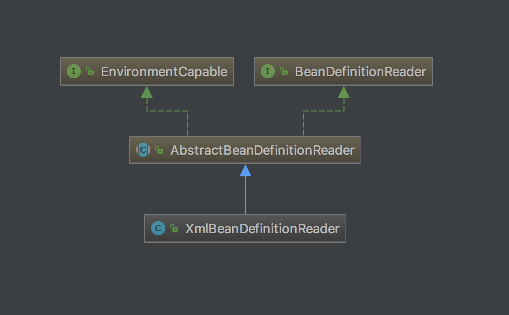
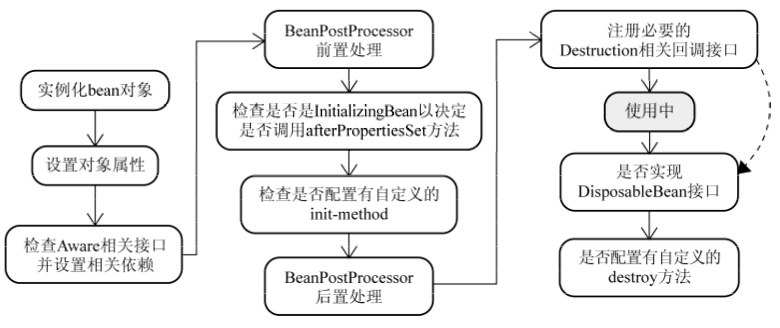

# Spring-Bean

文章部分内容来自：

https://blog.csdn.net/benhuo931115/article/details/74611464

https://www.zhihu.com/question/38597960

陈雄华. Spring 3.x企业应用开发实战 (Kindle Locations 1436-1437). 电子工业出版社. Kindle Edition. 

##beans包的层级结构

beans包中的各个源码包的功能如下

- src/main/java 用于展现Spring的主要逻辑
- src/main/resources 用于存放系统的配置文件
- src/test/java 用于对主要逻辑进行单元测试
- src/test/resources 用于存放测试用的配置文件

Spring可以通过4种方式配置bean，其一是基于xml的配置，其二种是基于xml+注解的配置，其三是基于java+注解的配置，其四是基于property文件的配置。前两种的配置信息使用XmlBeanDefinitionReader对象来解析；第三种的配置信息使用AnnotatedBeanDefinitionReader对象来解析；最后一种的配置信息使用PropertiesBeanDefinitionReader对象来解析。

## 核心类介绍

###DefaultListableBeanFactory

XmlBeanFactory继承自DefaultListableBeanFactory，而DefaultListableBeanFactory是整个bean加载的核心部分，是Spring注册及加载bean的默认实现，而对于XmlBeanFactory与DefaultListableBeanFactory不同的地方其实是在XmlBeanFactory中使用了自定义的XML读取器XmlBeanDefinitionReader，实现了个性化的BeanDefinitionReader读取，DefaultListableBeanFactory继承了AbstractAutowireCapableBeanFactory并实现了ConfigURableListableBeanFactory以及BeanDefinitionRegistry接口。

以下是ConfigURationListableBeanFactory的层次结构图以下相关类图

类图中各个类的作用：

- AliasRegistry：定义对alias的简单增删改等操作
- SimpleAliasRegistry：主要使用map作为alias的缓存，并对接口AliasRegistry进行实现
- SingletonBeanRegistry：定义对单例的注册及获取
- BeanFactory：定义获取bean及bean的各种属性
- DefaultSingletonBeanRegistry：对接口SingletonBeanRegistry各函数的实现
- HierarchicalBeanFactory：继承BeanFactory，也就是在BeanFactory定义的功能的基础上增加了对parentFactory的支持
- BeanDefinitionRegistry：定义对BeanDefinition的各种增删改操作
- FactoryBeanRegistrySupport：在DefaultSingletonBeanRegistry基础上增加了对FactoryBean的特殊处理功能
- ConfigurableBeanFactory：提供配置Factory的各种方法
- ListableBeanFactory：根据各种条件获取bean的配置清单
- AbstractBeanFactory：综合FactoryBeanRegistrySupport和ConfigurationBeanFactory的功能
- AutowireCapableBeanFactory：提供创建bean、自动注入、初始化以及应用bean的后处理器
- AbstractAutowireCapableBeanFactory：综合AbstractBeanFactory并对接口AutowireCapableBeanFactory进行实现
- ConfigurableListableBeanFactory：BeanFactory配置清单，指定忽略类型及接口等
- DefaultListableBeanFactory：综合上面所有功能，主要是对Bean注册后的处理

###XmlBeanDefinitionReader

XML配置文件的读取是Spring中重要的功能，因为Spring的大部分功能都是以配置作为切入点的，可以从XmlBeanDefinitionReader中梳理一下资源文件读取、解析及注册的大致脉络。

- XmlWebApplicationContext解析配置文件分为以下2个过程：

  1） 创建并初始化XmlBeanDefinitionReader 对象。

  2）使用XmlBeanDefinitionReader 对象提供的接口方法来加载BeanDefinition对象。

##Bean 的生命周期

对于普通的Java对象，当new的时候创建对象，当它没有任何引用的时候被垃圾回收机制回收。而由Spring IoC容器托管的对象，它们的生命周期完全由容器控制。Spring中每个Bean的生命周期大概如下：

1. 当调用者通过`getBean(beanName)`向容器请求某一个Bean时，如果容器注册了`org.springframework.beans.factory.config.InstantiationAwareBeanPostProcessor`接口，在实例化Bean之前，将调用接口的`postProcessBeforeInstantiation()`方法；
2. 根据配置情况调用Bean构造函数或工厂方法实例化Bean；
3. 如果容器注册了`InstantiationAwareBeanPostProcessor`接口，在实例化Bean之后，调用该接口的`postProcessAfterInstantiation()`方法，可在这里对已经实例化的对象进行一些“梳妆打扮”；
4. 如果Bean配置了属性信息，容器在这一步着手将配置值设置到Bean对应的属性中，不过在设置每个属性之前将先调用`InstantiationAwareBeanPostProcessor`接口的`postProcessPropertyValues()`方法；
5. 调用Bean的属性设置方法设置属性值；
6. 如果Bean实现了`org.springframework.beans.factory.BeanNameAware`接口，将调用setBeanName()接口方法，将配置文件中该Bean对应的名称设置到Bean中；
7. 如果Bean实现了`org.springframework.beans.factory.BeanFactoryAware`接口，将调用`setBeanFactory()`接口方法，将BeanFactory容器实例设置到Bean中；
8. 如果`BeanFactory`装配了`org.springframework.beans.factory.config.BeanPostProcessor`后处理器，将调用`BeanPostProcessor`的`ObjectpostProcessBeforeInitialization(Objectbean,StringbeanName)`接口方法对Bean进行加工操作。其中入参bean是当前正在处理的Bean，而`beanName`是当前Bean的配置名，返回的对象为加工处理后的Bean。用户可以使用该方法对某些Bean进行特殊的处理，甚至改变Bean的行为，`BeanPostProcessor`在Spring框架中占有重要的地位，为容器提供对Bean进行后续加工处理的切入点，Spring容器所提供的各种“神奇功能”（如AOP，动态代理等）都通过`BeanPostProcessor`实施；
9. 如果Bean实现了`InitializingBean`的接口，将调用接口的`afterPropertiesSet()`方法；
10. 如果在`<bean>`通过`init-method`属性定义了初始化方法，将执行这个方法；
11. `BeanPostProcessor`后处理器定义了两个方法：其一是`postProcessBeforeInitialization()`在第8步调用；其二是`ObjectpostProcessAfterInitialization(Objectbean,StringbeanName)`方法，这个方法在此时调用，容器再次获得对Bean进行加工处理的机会；
12. 如果在`<bean>`中指定Bean的作用范围为`scope=“prototype”`，将Bean返回给调用者，调用者负责Bean后续生命的管理，Spring不再管理这个Bean的生命周期。如果作用范围设置为scope=“singleton”，则将Bean放入到SpringIoC容器的缓存池中，并将Bean引用返回给调用者，Spring继续对这些Bean进行后续的生命管理；
13. 对于`scope=“singleton”`的Bean，当容器关闭时，将触发Spring对Bean的后续生命周期的管理工作，首先如果Bean实现了`DisposableBean`接口，则将调用接口的`destroy()`方法，可以在此编写释放资源、记录日志等操作；
14. 对于`scope=“singleton”`的Bean，如果通过`<bean>`的`destroy-method`属性指定了Bean的销毁方法，Spring将执行Bean的这个方法，完成Bean资源的释放等操作。