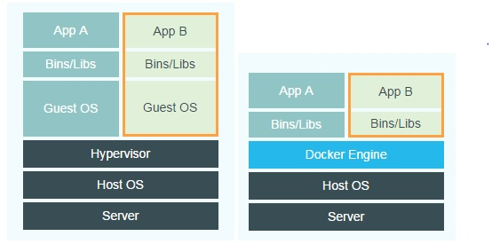

#什么是Docker？

Docker是一种应用程序的容器。

那什么是容器（Container）呢？

容器像仓库一样，一个仓库放一个或者多个执行中的程序，这个仓库提供了这个程序执行所需的运行环境。

比如PC就像一个容器，存放了数据以及各种软件，还为这些软件提供了运行的环境。使之能运行。

虚拟机也是一种容器，虚拟了硬件以及运行环境。

相比虚拟机，Docker更加快速，高效，因为Docker并非像虚拟机那样虚拟硬件，而是直接使用宿主机硬件。

注意一点：**Docker不是虚拟机**

虽然Docker和虚拟机类似，隔离了文件，应用程序，运行环境。

但是虚拟机是从硬件上的部分进行了隔离，而Docker好比只是把依赖包和文件和应用程序打成了一个包。而Docker只需运行这些包即可。Docker不是从硬件上隔离，相比虚拟机有不足的隔离性，但随之带来的好处就是高效化，启动一个容器不需要1s。

**Docker 和 虚拟机的应用方向**

Docker主要解决的是应用开发，测试和部署，内核也都是共享的，能让应用快速上线，快速迭代。在微服务的方向下，能将各个服务进行隔离，每个服务有独立的开发测试环境。

虚拟机不同，虚拟机是完全虚拟了一台PC或者服务器出来，连硬件都是虚拟的。

Docker鼓励是单服务容器，即一个服务一个容器。

# Docker 与虚拟机不同之处

虽然docker和虚拟机几乎完全不同，但是我们经常用虚拟机和用docker的事情很多都是重叠的，其中主要的一点就是隔离应用。这样难免我们不会去拿他们进行比较

上图：左侧为虚拟机，右侧为Docker

> Host OS:宿主机系统
>
> Guest OS:虚拟机系统
>
> Hypervisor:Hyper虚拟机

相比虚拟机，Docker少了GuestOS，Hyper虚拟机相比Docker Engine还需要虚拟出硬件

因为构造的不同，Docker的启动速度和数量级远超于虚拟机的

