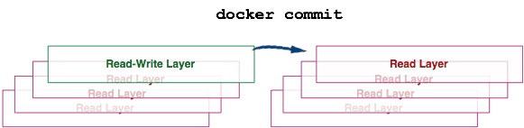
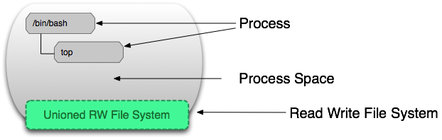

# Docker的镜像

##1 镜像与容器

这一章节有关资料来自：http://dockone.io/article/783

Docker容器也有自己的镜像

不如说Docker容器就是建立在镜像上面的。

先上图：


docker容器是分层结构，分为只读层和读写层。只读层由镜像组成，读写层是实际上容器运行服务的那一层。


一个docker容器内部可能含有多个镜像，这几个镜像重叠在一起，然后由上个镜像通过指针引导到下个镜像，但是docker操作的时候一般不让用户察觉，则外部“默认”为一个镜像。



在一个镜像的容器上面装了某些服务或者修改了某些文件都是不会对镜像造成任何影响的，因为镜像只能只读，所有修改都在读写层进行。而你假如将这读写层的内容制作成一个新的镜像的话(docker commit)，原有的镜像也不会改变，而是在你新建的镜像中引入父级指针指向原有的镜像。

> 比如你用centos镜像上建立了一个安装了tomcat服务的docker镜像，然后又用你的镜像创建一个docker容器，那这个容器运行的时候内部实际上是有两个镜像的，一个是centos的Base镜像，一个是装了tomcat的你个人自定义的镜像。


最上面那一层是容器可读写的，也可以当做是可读写的“镜像”。

**容器 = 镜像 + 读写层**

 

运行中的容器如上图所示。

下图展示了容器运行的时对文件的操作


上面知道docker容器分为读写层和只读镜像层。那如果对镜像文件操作的话，docker会从只读镜像中拷贝这份文件出来，做为一个可读写副本，并隐藏旧的只读文件，使之操作的只是副本。当然这些数据跟着容器，容器删除了就没了，想要数据持久化，宿主机还得整个挂载文件夹到容器内


## 2 镜像的操作

###创建镜像

docker允许创建自定义镜像，创建镜像有两种方式：docker build 与 docker commit

####docker build

docker build是使用Dockerfile脚本文件来进行制作镜像

Dockerfile

官方对于Dockerfile是这么解释的：

A Dockerfile is a text document that contains all the commands you would normally execute manually in order to build a Docker image. Docker can build images automatically by reading the instructions from a Dockerfile.

Dockerfile 有以下几个部分组成

- 基础镜像
- 维护者信息
- 对于镜像的操作的命令
- 容器启动的时候执行的命令

Dockerfile 中内容的格式

```dockerfile
# Comment
INSTRUCTION arguments
```

Example:


```dockerfile
FROM golang:1.9.2-alpine3.6 AS build

# Install tools required to build the project
# We need to run `docker build --no-cache .` to update those dependencies
RUN apk add --no-cache git
RUN go get github.com/golang/dep/cmd/dep

# Gopkg.toml and Gopkg.lock lists project dependencies
# These layers are only re-built when Gopkg files are updated
COPY Gopkg.lock Gopkg.toml /go/src/project/
WORKDIR /go/src/project/
# Install library dependencies
RUN dep ensure -vendor-only

# Copy all project and build it
# This layer is rebuilt when ever a file has changed in the project directory
COPY . /go/src/project/
RUN go build -o /bin/project

# This results in a single layer image
FROM scratch
COPY --from=build /bin/project /bin/project
ENTRYPOINT ["/bin/project"]
CMD ["--help"]
```

Dockerfile 指令

#####ARG 变量

The `ARG` instruction defines a variable that users can pass at build-time to the builder with the docker build command using the`--build-arg <varname>=<value>` flag. If a user specifies a build argument that was not defined in the Dockerfile, the build outputs a warning.

```dockerfile
ARG <name>[=<default value>]
```
调用时候用`$<name>`来调用
E.g.
dockerfile:
```Dockerfile
ARG VERSION=latest
FROM centos:$VERSION
...
```
or docker build:
```Bash
docker build --build-arg VERSION=latest ....
```


#####FROM 来自基础镜像

The `FROM` instruction initializes a new build stage and sets the Base Image for subsequent instructions. As such, a valid Dockerfile must start with a FROM instruction. The image can be any valid image – it is especially easy to start by pulling an image from the Public Repositories.

```dockerfile
FROM <image> [AS <name>]
FROM <image>[:<tag>] [AS <name>]
FROM <image>[@<digest>] [AS <name>]
```
E.g.

```dockerfile
FROM centos:latest
```


#####MAINTAINER 维护信息(已弃用)

```dockerfile
MAINTAINER <name>
```
E.g.

```dockerfile
MAINTAINER FuneralObjects[874972403@qq.com]
```


#####LABEL 标签

Understanding object labels You can add labels to your image to help organize images by project, record licensing information, to aid in automation, or for other reasons. For each label, add a line beginning with `LABEL` and with one or more **key-value** pairs. The following examples show the different acceptable formats. Explanatory comments are included inline.

> Note: If your string contains spaces, it must be quoted or the spaces must be escaped. If your string contains inner quote characters ("), escape them as well.

E.g.

```dockerfile
LABEL com.example.version="0.0.1-beta"
```

```dockerfile
LABEL com.example.version="0.0.1-beta" com.example.release-date="2015-02-12"
```


#####RUN 执行命令

在生成的镜像中执行shell格式或者exec格式命令

The RUN instruction will execute any commands in a new layer on top of the current image and commit the results. The resulting committed image will be used for the next step in the Dockerfile.
每次执行一次RUN，docker就会执行commit命令生成一个镜像

```dockerfile
#/bin/bash -c <command>
RUN <command>
```
E.g.
```Dockerfile
RUN /bin/bash -c 'source $HOME/.bashrc; echo $HOME'
```


##### EXPOSE 开放端口

`EXPOSE`可以用来描述开放容器内部部分端口。主要用于描述该镜像所需发布的端口，但并不会自动发布端口。实际端口匹配还需在`docker run -p <hostPort>:<port>`中指定

```dockerfile
EXPOSE <port> [<port>/<protocol>...]
```

The `EXPOSE` instruction informs Docker that the container listens on the specified network ports at runtime. You can specify whether the port listens on TCP or UDP, and the default is TCP if the protocol is not specified.

E.g.

```Dockerfile
#http port
EXPOSE 80

#mysql port
EXPOSE 3306
```


##### ENV 环境变量

给容器环境内部设置环境变量。每`ENV`设置一次，同样会生成一次镜像。

To make new software easier to run, you can use `ENV` to update the `PATH` environment variable for the software your container installs. For example, `ENV PATH /usr/local/nginx/bin:$PATH` ensures that `CMD [“nginx”]` just works.

E.g.

```Dockerfile
ENV PG_MAJOR 9.3
ENV PG_VERSION 9.3.4
RUN curl -SL http://example.com/postgres-$PG_VERSION.tar.xz | tar -xJC /usr/src/postgress && …
ENV PATH /usr/local/postgres-$PG_MAJOR/bin:$PATH

ENV myName="John Doe" myDog=Rex\ The\ Dog \
    myCat=fluffy
```


#####ADD or COPY 向容器添加/传输文件

Although `ADD` and `COPY` are functionally similar, generally speaking, `COPY` is preferred. That’s because it’s more transparent than `ADD`. `COPY` only supports the basic copying of local files into the container, while `ADD` has some features (like local-only tar extraction and remote URL support) that are not immediately obvious. Consequently, the best use for `ADD` is local tar file auto-extraction into the image, as in `ADD rootfs.tar.xz /`.

E.g.

```dockerfile
COPY requirements.txt /tmp/
RUN pip install --requirement /tmp/requirements.txt
COPY . /tmp/
```

ADD 有 `curl` ， `wget`和`tar -xf`的功能，可以直接从互联网上下载资源，或者直接从tar包中提取

一般传输文件默认首选`COPY`,因为它只有将本地文件传输到镜像中的功能

E.g.

```dockerfile
ADD http://mirror.bit.edu.cn/apache/tomcat/tomcat-8/v8.5.29/bin/apache-tomcat-8.5.29.tar.gz /usr/opt/tomcat8.5.tar.gz
RUN tar -xf /usr/opt/tomcat8.5.tar.gz /usr/share/tomcat8.5
RUN rm -rf /usr/opt/tomcat8.5.tar.gz
```


##### CMD or  ENTRYPOINT 在容器内执行命令

`ENTRYPOINT`与`CMD`都是在容器层面上执行的命令，即不会产生新的镜像文件，是在容器产生后，进而在容器里面执行的命令。

> **CMD** 在创建后的容器内执行命令
>
> 如果有多条`CMD`命令，则只执行最后一条。一般在容器创建后要启动什么服务用。
>
> ```dockerfile
> CMD ["executable","param1","param2"]
> CMD ["param1","param2"]
> CMD command param1 param2
> ```
>
> `CMD`指令会被`docker run` 覆盖
>
> E.g.
>
> Dockerfile:
>
> ```dockerfile
> #....
> ENV M2_HOME=/usr/share/maven3
> CMD echo $M2_HOME
> ```
>
> 此时若执行了`docker run -it <image>:<tag> /bin/bash`，则docker会忽略`echo $M2_HOME`只执行`/bin/bash`
>
> 
>
> **ENTRYPOINT** 让容器以应用程序或者服务的形式运行
>
> 同`CMD`类似，但是`ENTRYPOINT`不会被忽略,一定会被执行，即时运行了`docker run `时指定了其他命令也会执行。
>
> ```dockerfile
> ENTRYPOINT ["executable", "param1", "param2"]
> ENTRYPOINT command param1 param2
> ```
>
> 使用`ENTRYPONINT`的时候`CMD`和`docker run`可以为其传递覆盖参数
>
> E.g.
>
> ```dockerfile
> FROM ubuntu
> ENTRYPOINT ["echo", "hello"]
> CMD ["world"]
> ```
>
> docker run:
>
> `docker run -it <image>` —> `hello world`
>
> `docker run -it <image> docker` —> `hello docker`

The table below shows what command is executed for different `ENTRYPOINT` / `CMD` combinations:

|                                | No ENTRYPOINT              | ENTRYPOINT exec_entry p1_entry | ENTRYPOINT [“exec_entry”, “p1_entry”]          |
| ------------------------------ | -------------------------- | ------------------------------ | ---------------------------------------------- |
| **No CMD**                     | *error, not allowed*       | /bin/sh -c exec_entry p1_entry | exec_entry p1_entry                            |
| **CMD [“exec_cmd”, “p1_cmd”]** | exec_cmd p1_cmd            | /bin/sh -c exec_entry p1_entry | exec_entry p1_entry exec_cmd p1_cmd            |
| **CMD [“p1_cmd”, “p2_cmd”]**   | p1_cmd p2_cmd              | /bin/sh -c exec_entry p1_entry | exec_entry p1_entry p1_cmd p2_cmd              |
| **CMD exec_cmd p1_cmd**        | /bin/sh -c exec_cmd p1_cmd | /bin/sh -c exec_entry p1_entry | exec_entry p1_entry /bin/sh -c exec_cmd p1_cmd |

> note:
>
> **RUN,ENTRYPOINT,CMD**使用场景
>
> `RUN`适合用来安装应用和软件，构建镜像
>
> `ENTRYPOINT`适合用来运行程序或者服务，比如Mysql,Tomcat等
>
> `CMD`除了在容器执行的时候运行一些简单命令外，还比较适合用于`ENTRYPOINT`的默认参数


#####VOLUME 挂载

由于容器内数据和服务是隔离的，也就导致容器内的数据会随着容器存在，一旦删除或者丢失容器，容器内的数据基本无法找回，则需要脱离容器进行持久化的的数据区进行挂载到容器内部。

比如数据库的数据文件，Redis的缓存数据等。

```dockerfile
VOLUME dir
VOLUME ["dir1","dir2"]
VOLUME dir1 dir2
```

E.g.

```dockerfile
FROM ubuntu
RUN mkdir /mydata
RUN echo "hello world" > /mydata/data1
VOLUME /mydata
```


##### USER 

如果执行的服务不需要Root权限，则建议使用`USER`来新建和操作其他用户来执行此服务。

```dockerfile
USER <user>[:<group>]
USER <UID>[:<GID>]
```

> **Note**: Users and groups in an image get a non-deterministic UID/GID in that the “next” UID/GID gets assigned regardless of image rebuilds. So, if it’s critical, you should assign an explicit UID/GID.


##### WORKDIR 切换工作空间

类似`RUN cd <dir>`

```dockerfile
WORKDIR /path/to/workdir
```

E.g.

```dockerfile
WORKDIR /a
WORKDIR b
WORKDIR c
RUN pwd
```

实际输出为`/a/b/c`


##### ONBUILD

在该镜像作为`base image`基础上创建新的镜像时候，要在新的镜像中插入`dockerfile`指令，插入位置则是在`FROM`下

```dockerfile
ONBUILD [INSTRUCTION]
```

E.g.

```Dockerfile
[...]
ONBUILD ADD . /app/src
ONBUILD RUN /usr/local/bin/python-build --dir /app/src
[...]
```


#### docker commit

docker commit 是以某个容器制作成镜像，常用于临时修改某个配置等

