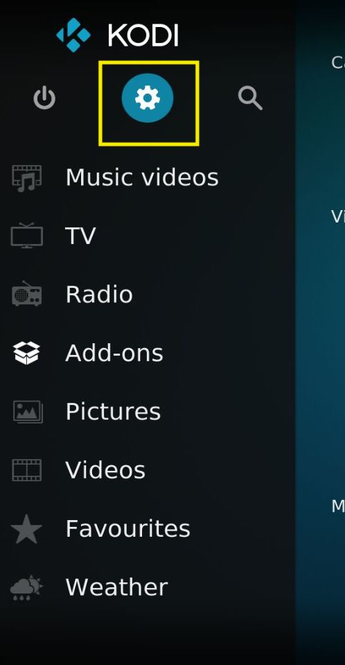
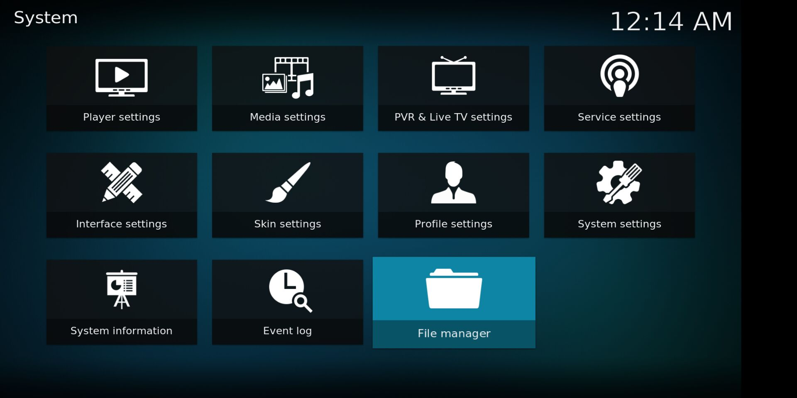
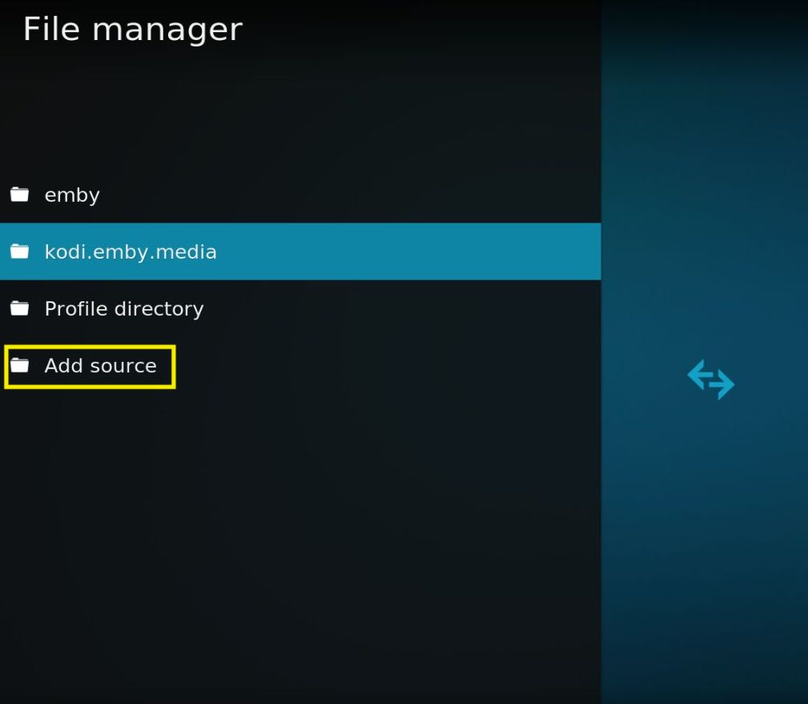
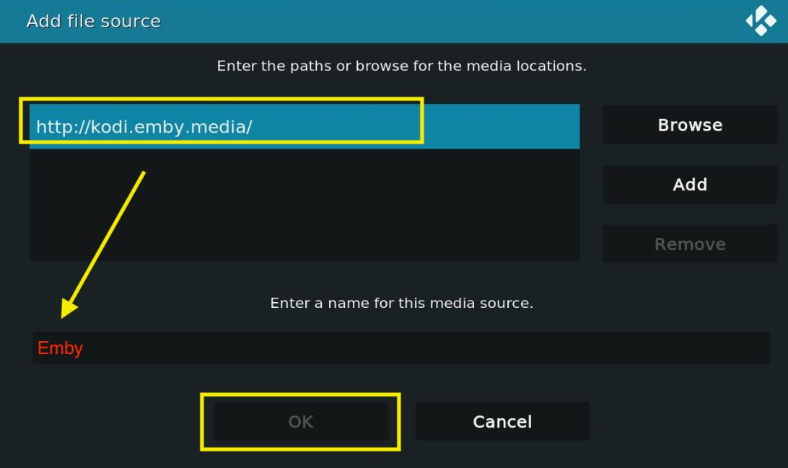
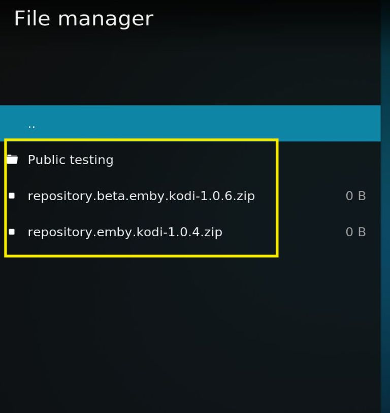
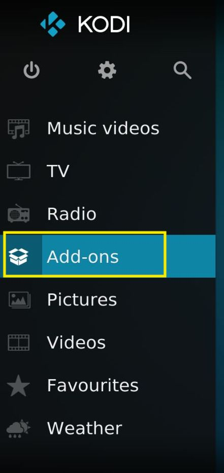
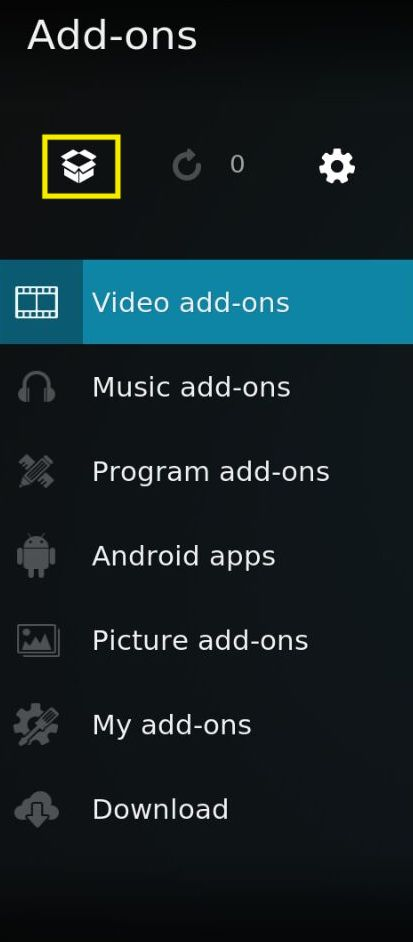
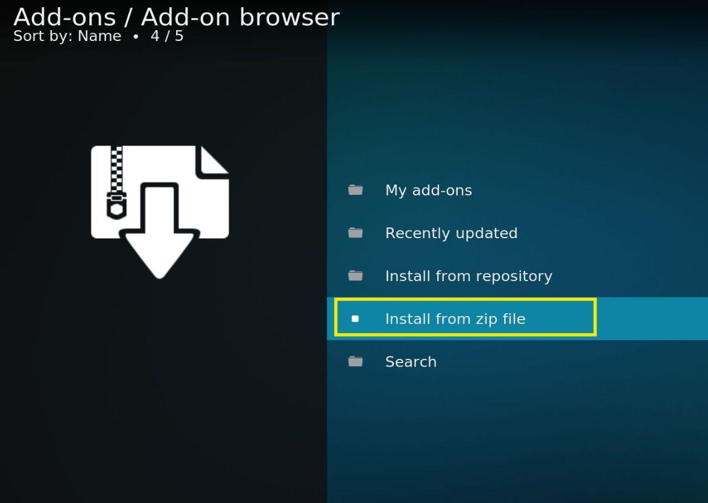
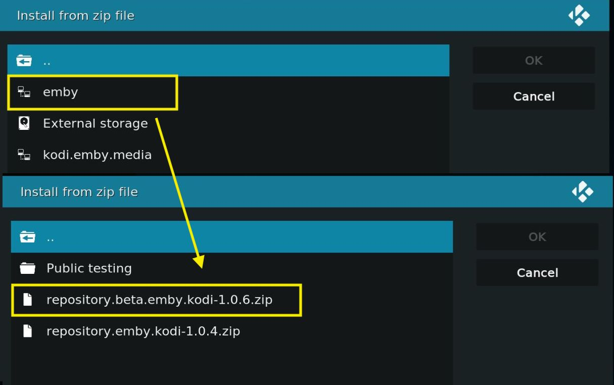
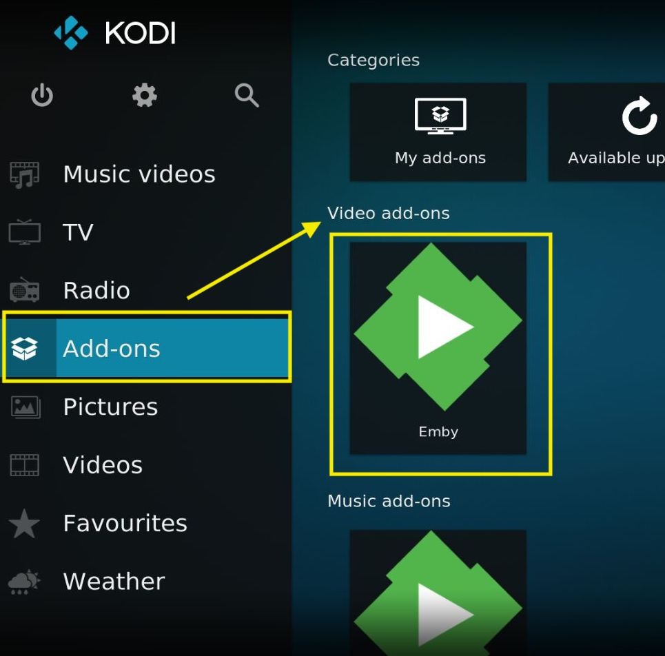

# kodi 客户端 安装emby 插件

## 1.添加Emby源

Setting -> File Manager -> Add Source ->  **http://kodi.emby.media**

添加后别忘了点击进去看看是不是能正常访问到官方源

## 2.安装Emby插件

Add-ons -> Add-on browser -> Install from zip file -> 选择emby(刚刚Add Source 添加的) -> repository.beta.emby.kodi-1.0.6.zip(就选新的) -> 等待...直到提示安装完Emby Video Plugin。

## 3.配置Emby Server

如果你是在局域网内，kodi应该会自动搜索当前局域网的Emby Server

如果你是在外网。

Add-ons -> Video add-ons -> Emby -> Add Server -> ...填写URL用户名密码略 -> 添加完毕后，一些列弹窗就选默认就行

## 4. 添加Emby媒体库

Add-ons -> Video add-ons -> Emby -> Add libraries

